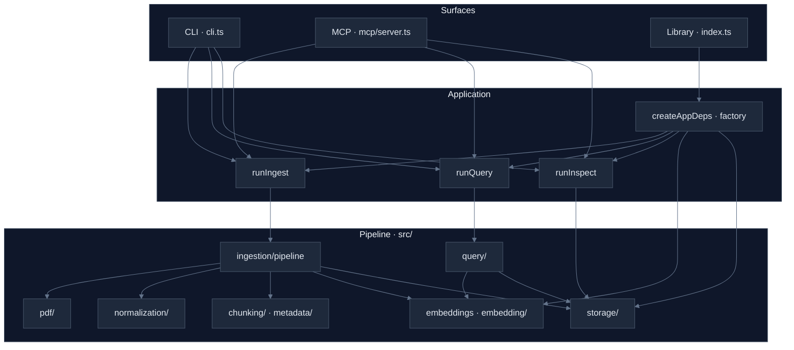
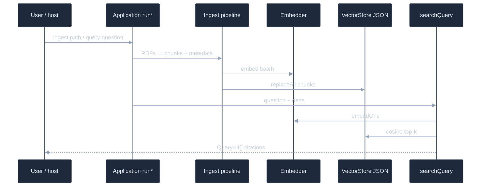

# pdf-to-rag

**Local-first RAG over PDFs:** index a folder of documents, embed text on your machine, and run **natural-language queries** that return **verbatim passages** with **file name and page**—so you can quote sources, not paraphrases. Ships as a **TypeScript CLI**, **library**, and optional **MCP server** for tools like Cursor.

---

## What it’s for

- **Researchers and builders** who want searchable PDF corpora without sending document text to a cloud embedding API.
- **Citation-aware retrieval:** each hit is a stored chunk string plus metadata (`fileName`, `page`, `score`, `chunkId`), suitable for footnotes or UI snippets.
- **Not in scope:** a single LLM “answer” that merges hits; hosts or models compose answers **from** the returned excerpts if needed.

---

## Install and use

**Requirements:** [Node.js 18+](https://nodejs.org/). First run may download a default embedding model (Transformers.js) unless you use Ollama (see expandable section below).

**From npm (when published):**

```bash
npm install -g pdf-to-rag
pdf-to-rag ingest ./path/to/pdfs
pdf-to-rag query your natural language question
pdf-to-rag inspect
```

**From this repository:**

```bash
git clone <repo-url> && cd pdf-to-rag
npm install
npm run build
node dist/cli.js ingest ./path/to/pdfs
node dist/cli.js query your natural language question
node dist/cli.js inspect
```

Common flags: `--store-dir` (index directory, default `.pdf-to-rag`), `ingest` `--chunk-size` / `--overlap`, `query` `--top-k`. Index file: `<store-dir>/index.json`.

<details>
<summary><strong>Verify the toolchain</strong></summary>

- **Smoke** (smallest PDF in `examples/`): `npm run examples:smoke`
- **JSON NL + quotation checks:** `npm run examples:fixtures` (see [examples/README.md](examples/README.md))
- **MCP install:** `npm run mcp:smoke` after `npm run build`

Optional git hooks: `npm run hooks:install` — see [.hooks/README.md](.hooks/README.md).

</details>

---

## Architecture

Entry points are thin; **CLI**, **library**, and **MCP** all call the same **application layer** (`runIngest`, `runQuery`, `runInspect`). The pipeline stays in `src/` modules (PDF → text → chunks → embeddings → JSON vector store).



**Ingest and query data flow:**



<details>
<summary><strong>Layer rules (where code belongs)</strong></summary>

- <strong><code>src/commands/</code></strong> — Commander only; prints results; calls <code>run*</code>.
- <strong><code>src/mcp/</code></strong> — stdio MCP, Zod tools, path allowlist; calls the same <code>run*</code>.
- <strong><code>src/application/</code></strong> — orchestration, <code>AppDeps</code>, hooks.
- <strong><code>src/domain/</code></strong> — types only; no I/O.
- <strong>Pipeline</strong> — <code>ingestion/</code>, <code>pdf/</code>, <code>normalization/</code>, <code>chunking/</code>, <code>metadata/</code>, <code>embeddings.ts</code>, <code>embedding/</code>, <code>storage/</code>, <code>query/</code>.

Full file-level map: <a href="docs/architecture/overview.md">docs/architecture/overview.md</a>.

</details>

---

## Documentation

| Resource | Description |
|----------|-------------|
| [docs/README.md](docs/README.md) | Doc index |
| [docs/use/cli-library.md](docs/use/cli-library.md) | CLI and library ↔ <code>src/</code> |
| [docs/use/mcp.md](docs/use/mcp.md) | MCP tools, env, security |
| [docs/onboarding/mcp.md](docs/onboarding/mcp.md) | First-time MCP setup |
| [docs/architecture/overview.md](docs/architecture/overview.md) | Deeper diagrams and tables |
| [docs/management/roadmap.md](docs/management/roadmap.md) | Roadmap |
| [docs/management/requirements.md](docs/management/requirements.md) | Requirements (F/N/D) |
| [docs/contributing/agents.md](docs/contributing/agents.md) | Cursor agents, <code>/pdf-*</code> commands |

<details>
<summary><strong>MCP server (AI tools)</strong></summary>

After <code>npm run build</code>, run <code>pdf-to-rag-mcp</code> (stdio) or <code>npx pdf-to-rag-mcp</code>. Configure corpus access with <code>PDF_TO_RAG_CWD</code>, <code>PDF_TO_RAG_ALLOWED_DIRS</code>, and optionally <code>PDF_TO_RAG_SOURCE_DIR</code>. Start here: <a href="docs/onboarding/mcp.md">docs/onboarding/mcp.md</a>; full reference: <a href="docs/use/mcp.md">docs/use/mcp.md</a>.

<strong>Cursor:</strong> rules in <a href=".cursor/rules/">.cursor/rules/</a>, skills in <a href=".cursor/skills/">.cursor/skills/</a> (<code>pdf-rag-*</code>), commands in <a href=".cursor/commands/">.cursor/commands/</a>.

</details>

<details>
<summary><strong>CLI commands (reference)</strong></summary>

```bash
pdf-to-rag ingest ./docs          # full reindex (recursive by default)
pdf-to-rag query your question    # semantic search; summary line + passages + citations
pdf-to-rag inspect               # chunk count / files (no embedder load)
```

Options: <code>--store-dir</code>, ingest <code>--chunk-size</code>, <code>--overlap</code>, <code>--no-recursive</code>, query <code>--top-k</code>.

</details>

<details>
<summary><strong>Library (programmatic)</strong></summary>

```ts
import {
  defaultConfig,
  createAppDeps,
  runIngest,
  runQuery,
  runInspect,
  createNoOpHooks,
} from "pdf-to-rag";

const cwd = process.cwd();
const config = defaultConfig({});
const hooks = createNoOpHooks();
const deps = await createAppDeps(cwd, config);

await runIngest("./my-pdfs", cwd, deps, hooks);
const hits = await runQuery("your natural-language question", deps, hooks);
for (const h of hits) {
  console.log(h.fileName, h.page, h.text);
}

const stats = await runInspect(cwd, config);
console.log(stats.chunkCount, stats.files);
```

Use a custom <code>Hooks</code> object for <code>beforeIngest</code>, <code>afterChunking</code>, <code>afterIndexing</code>, <code>beforeQuery</code>. <code>runInspect</code> does not load the embedding model.

</details>

<details>
<summary><strong>Embeddings: Transformers.js (default) and Ollama (optional)</strong></summary>

<strong>Default:</strong> <a href="https://github.com/xenova/transformers.js">Transformers.js</a> / ONNX in Node — no paid API; suitable for small corpora; large multi-PDF folders can be slow on CPU. Model download on first use (~tens of MB); set <code>TRANSFORMERS_CACHE</code> to pin cache location.

<strong>Optional fast path:</strong> <code>PDF_TO_RAG_EMBED_BACKEND=ollama</code>, <code>OLLAMA_EMBED_MODEL</code> (e.g. <code>nomic-embed-text</code> after <code>ollama pull</code>), optional <code>OLLAMA_HOST</code> (default <code>http://127.0.0.1:11434</code>). Batching: <code>OLLAMA_EMBED_BATCH_SIZE</code>, <code>OLLAMA_EMBED_CONCURRENCY</code>. With GPU or Apple Metal, full ingest of an <code>examples/</code>-scale tree can be on the order of minutes; CPU-only may be much slower.

<strong>Important:</strong> re-ingest after switching backend or model; the index records <code>embeddingModel</code> (e.g. <code>ollama:nomic-embed-text</code>). Query embedding dimension must match the index.

See <a href="docs/management/requirements.md">docs/management/requirements.md</a> (F7) and <a href=".cursor/commands/pdf-embeddings.md">.cursor/commands/pdf-embeddings.md</a>.

</details>

<details>
<summary><strong>Examples and tests</strong></summary>

- PDFs (or your own) under <a href="examples/">examples/</a> — <a href="examples/README.md">examples/README.md</a>
- <code>npm run examples:smoke</code> — minimal ingest + query
- <code>npm run examples:fixtures</code> — <code>examples/query-fixtures.json</code> NL + substring suite

</details>

<details>
<summary><strong>Limitations (current MVP)</strong></summary>

- Full reindex on each <code>ingest</code> (no incremental updates).
- Search is linear cosine over stored vectors — fine for modest corpora; replace <code>VectorStore</code> if you outgrow it.
- Scanned PDFs without extractable text are not a primary target.

</details>

## License

MIT
