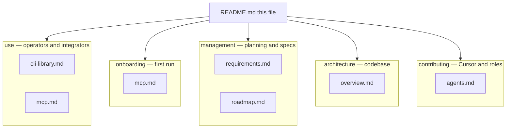

# pdf-to-rag documentation

Docs are grouped by purpose. The **published npm tarball** includes everything under `docs/` (see `package.json` `files`).

## Site map

| Section | Path | Audience |
|---------|------|----------|
| **Use** | [use/cli-library.md](./use/cli-library.md), [use/mcp.md](./use/mcp.md) | CLI, library imports, MCP hosts |
| **Onboarding** | [onboarding/mcp.md](./onboarding/mcp.md) | First MCP setup from a clone or install |
| **Management** | [management/requirements.md](./management/requirements.md), [management/roadmap.md](./management/roadmap.md) | Scope, F/N/D traceability, **dependencies & deliverables** (including embedding backends), phases, milestones, releases |
| **Architecture** | [architecture/overview.md](./architecture/overview.md) | Layers, `src/` layout, ingest/query flows |
| **Contributing** | [contributing/agents.md](./contributing/agents.md) | Rules vs skills vs commands; `/pdf-*`; subagent roles |

Start with the root [README.md](../README.md) for install, CLI examples, and library snippet.

**Cursor (this repo):** Passive rules in [`.cursor/rules/`](../.cursor/rules/). Procedural **skills** in [`.cursor/skills/`](../.cursor/skills/) (`pdf-rag-*`). Manual **`/pdf-*` commands** in [`.cursor/commands/`](../.cursor/commands/). Subagents in [`.cursor/agents/`](../.cursor/agents/). Hooks: [`.cursor/hooks.json`](../.cursor/hooks.json) ([Cursor hooks](https://cursor.com/docs/hooks)). Full doc sync: **`/pdf-update-docs`**.

See [contributing/agents.md](./contributing/agents.md) for how rules, skills, and commands fit together ([reference article](https://www.ibuildwith.ai/blog/cursor-rules-skills-and-commands-oh-my-when-to-use-each/)).
