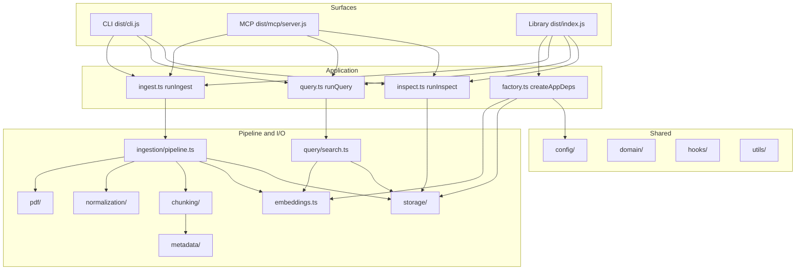
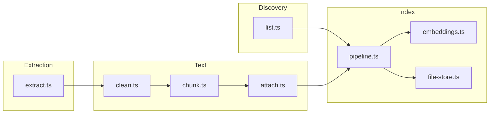
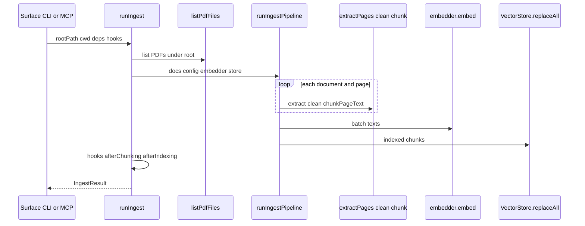
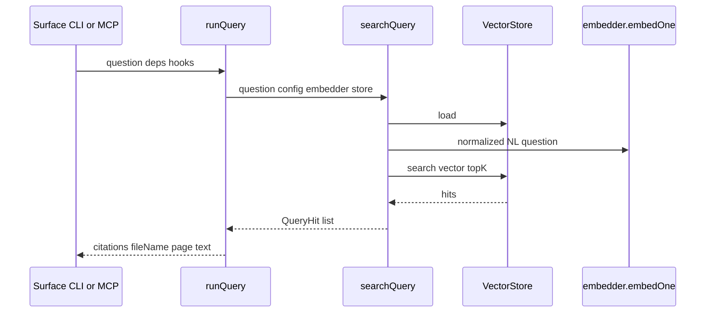
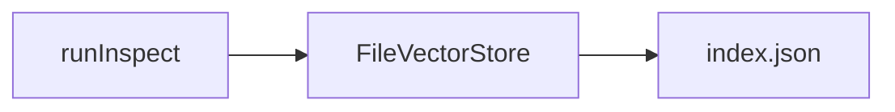

# Architecture overview

How **pdf-to-rag** is structured in `src/`: entry points, application layer, pipeline, and storage. CLI, library consumers, and the MCP server all call the same **application API**.

## Layered model

**Rules of thumb**

- **`src/commands/`** — Commander wiring and stdout only; calls `runIngest` / `runQuery` / `runInspect`.
- **`src/mcp/`** — stdio MCP server, Zod-shaped tool I/O, path policy (`paths.ts`), result envelope (`tool-results.ts`); calls the same `run*` functions.
- **`src/application/`** — Orchestration, `AppDeps`, hooks around ingest/query.
- **`src/domain/`** — Types only (documents, chunks, results); no I/O.
- **`src/ingestion/pipeline.ts`** — Core ingest stages: PDF → text → chunks → embed → `VectorStore.replaceAll`.

## Source tree (by responsibility)

| Path | Role |
|------|------|
| `cli.ts` | CLI entry; registers `ingest`, `query`, `inspect` commands. |
| `commands/` | `ingest.ts`, `query.ts`, `inspect.ts` — parse args, print results. |
| `application/` | `createAppDeps`, `runIngest`, `runQuery`, `runInspect`, `deps.ts`, `factory.ts` (selects Transformers vs Ollama from **`PDF_TO_RAG_EMBED_BACKEND`**, merges effective `embeddingModel` into config for Ollama). |
| `mcp/` | `server.ts`, `paths.ts`, `tool-results.ts`, `version.ts`. |
| `config/` | Defaults and `PdfToRagConfig` (`defaults.ts`). |
| `domain/` | `document`, `page`, `chunk`, `metadata`, `results` types. |
| `hooks/` | `Hooks` and lifecycle payloads for library users. |
| `pdf/` | `list.ts` (discover PDFs), `extract.ts` (page text via pdfjs). |
| `normalization/` | `clean.ts` — page text cleanup before chunking. |
| `chunking/` | `chunk.ts` — overlapping character windows + `attachMetadata`. |
| `metadata/` | `attach.ts` — deterministic chunk ids and file/page metadata. |
| `ingestion/` | `pipeline.ts` — `runIngestPipeline`; `index.ts` re-exports. |
| `embeddings.ts` | Public barrel: `createEmbedder` (Transformers default), `createTransformersEmbedder`, `createOllamaEmbedder`, `Embedder` type. |
| `embedding/` | Implementations: `transformers.ts` (Transformers.js), `ollama.ts` (HTTP `/api/embed` batch + `/api/embeddings` fallback, L2-normalized vectors). |
| `storage/` | `FileVectorStore`, JSON index on disk, linear search; **`search`** validates query vs stored embedding dimension. |
| `query/` | `search.ts` — `normalizeQueryText`, `searchQuery` (load index, normalize NL question, embed, cosine top-k over chunks). |

## Ingest data flow

## Query data flow

## Inspect path

`runInspect` **does not** load the embedding model. It constructs `FileVectorStore` for the index path, `load()`s JSON only, and returns chunk count and source file list.

## Public API surface (`src/index.ts`)

The package root export re-exports domain types, config defaults, hooks, **`createAppDeps` / `runIngest` / `runQuery` / `runInspect`**, embedder and store types, and lower-level helpers (`runIngestPipeline`, `searchQuery`, PDF list/extract, etc.) for advanced use.

## Related docs

- Usage (CLI, library, MCP host config): [use/](../use/) and root [README.md](../../README.md).
- Requirements and roadmap: [management/](../management/).
- MCP operator quick start: [onboarding/mcp.md](../onboarding/mcp.md).
