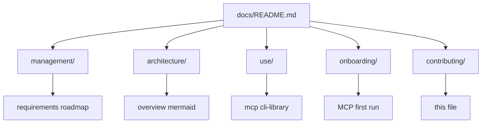

# Sub-agent playbook

Use these roles when planning work, splitting PRs, or reviewing changes. They describe **human or AI contributor focus**, not Cursor product features.

## Rules vs skills vs commands

This repo follows the split described in [Cursor Rules, Skills, and Commands – when to use each](https://www.ibuildwith.ai/blog/cursor-rules-skills-and-commands-oh-my-when-to-use-each/) (rules guide, skills do, commands trigger).

| Mechanism | Role here | Location |
|-----------|-----------|----------|
| **Rules** | Passive standards (layers, constraints) | [`.cursor/rules/pdf-to-rag.mdc`](../../.cursor/rules/pdf-to-rag.mdc) |
| **Skills** | Procedural workflows (checklists, file paths) | [`.cursor/skills/`](../../.cursor/skills/) — `pdf-rag-planning`, `pdf-rag-architecture`, `pdf-rag-pipeline`, `pdf-rag-mcp`, `pdf-rag-docs-sync`, `pdf-rag-security` |
| **Commands** | Manual `/pdf-*` shortcuts that point the agent at a skill | [`.cursor/commands/`](../../.cursor/commands/) |
| **Subagents** | Delegation personas; body points at the matching skill | [`.cursor/agents/`](../../.cursor/agents/) |

Cursor may also list skills under `/` (e.g. `/pdf-rag-docs-sync`). **Prefer `/pdf-*` commands** for a consistent prefix. Commands are thin wrappers: they tell the agent to read the corresponding `SKILL.md`.

## Cursor (this repo only)

| Mechanism | Prefix / names | Purpose |
|-----------|------------------|---------|
| **Slash commands** | `/pdf-…` | `/pdf-plan`, `/pdf-architect`, `/pdf-mcp`, `/pdf-library`, `/pdf-embeddings`, `/pdf-dx`, `/pdf-security`, `/pdf-update-docs` |
| **Skills** | `pdf-rag-*` folders | Full procedures in each folder’s `SKILL.md` |
| **Subagents** | `pdf-planner`, `pdf-architect`, … | Same roles; YAML `description` drives when Cursor delegates |

Use **`/pdf-update-docs`** (or subagent `pdf-update-docs`) after API, CLI, or MCP changes to refresh docs against the code.

## Documentation layout (this repo)

## Planner

- **Owns:** Roadmap slices, acceptance criteria, sequencing risks (model download size, ingest duration).
- **Outputs:** Task breakdowns linked to [requirements.md](../management/requirements.md) IDs.
- **When:** Before large features or releases.
- **Skill:** `pdf-rag-planning`

## Architect

- **Owns:** Boundaries between MCP transport, application layer, and pipeline modules; tool JSON schemas; allowlist design.
- **Outputs:** Updates to [architecture/overview.md](../architecture/overview.md) when behavior crosses layers.
- **When:** New MCP tools, config surface, or storage format discussions.
- **Skill:** `pdf-rag-architecture`

## MCP integrator

- **Owns:** `@modelcontextprotocol/sdk` wiring, stdio entrypoint, mapping library errors to MCP tool results.
- **Outputs:** Changes under `src/mcp/` only, plus [use/mcp.md](../use/mcp.md) updates.
- **When:** MCP protocol or client compatibility work.
- **Verify:** After changes, run `npm run build` and `npm run mcp:smoke`.
- **Skill:** `pdf-rag-mcp`

## Library maintainer

- **Owns:** `src/application/`, `src/ingestion/`, `src/pdf/`, `src/storage/`, `src/embedding/`, `src/embeddings.ts`, etc.—core RAG behavior shared by CLI, library, and MCP.
- **Outputs:** Pipeline and types; no CLI/MCP-specific code in domain or ingestion modules. Embedding selection: **Transformers (default)** vs **Ollama (env)** per [requirements § F7](../management/requirements.md#functional-traceability).
- **When:** Chunking, embeddings, PDF parsing, or index format changes.
- **Skill:** `pdf-rag-pipeline` (use **`/pdf-embeddings`** for embed-backend-focused work)

## DX / docs

- **Owns:** Root README, `docs/**`, example configs for Cursor and other hosts.
- **Outputs:** Copy edits, snippets, troubleshooting tables.
- **When:** Any user-visible command, env var, or tool shape change.
- **Skill:** `pdf-rag-docs-sync` (DX-only section when appropriate)

## Security reviewer

- **Owns:** Path validation, dependency review for MCP SDK, least-privilege guidance for how users launch the server.
- **Outputs:** Checklist in PR template or notes in [use/mcp.md § Security](../use/mcp.md#security).
- **When:** New filesystem inputs, new dependencies, or deployment guidance updates.
- **Skill:** `pdf-rag-security`
