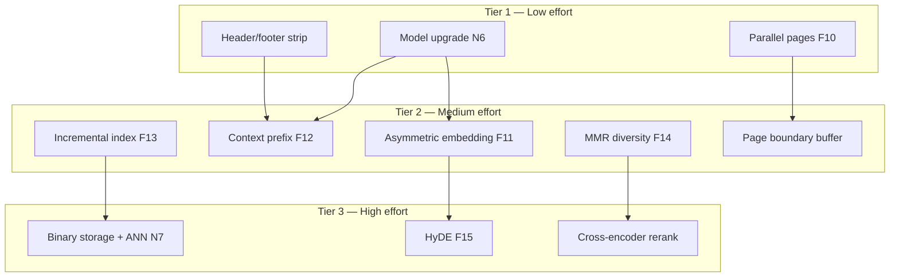

# Project overview

**pdf-to-rag** is a **public npm package** for local-first PDF RAG: ingest text PDFs → chunk → embed → a JSON (+ optional binary) index; **query** returns **verbatim** excerpts with **file** and **page** citations. The **CLI**, **library**, and **MCP** servers share one application layer (`createAppDeps` / `createAppEmbedder`). Traceable requirements (**F** / **N** / **D**) live in [requirements.md](./requirements.md). Phased delivery and status live in [roadmap.md](./roadmap.md). **This file** holds the executive summary, portfolio priorities, **testing / evaluation methodology**, and a **historical embedding & pipeline reference** (most items are already implemented).

## Outcomes we optimize for

| Outcome | Success looks like |
|---------|-------------------|
| **Usable locally** | Ingest a folder of PDFs and **query** with **verbatim excerpts** and correct **file + page** citations so answers can **quote** evidence; validate with **`inspect`**, **`query`**, and **`examples:smoke`** (see [roadmap § Query validation](./roadmap.md#query-validation-quotation-ready-retrieval-and-testing)). |
| **Embeddable** | Same behavior via **library** import or **MCP** tools, not duplicate pipelines. |
| **Installable from npm** | Anyone can use **CLI**, **library**, and **MCP** via `npm install` / `npx` without cloning; tarball matches `package.json` `files` and [requirements § Public npm package](./requirements.md#public-npm-package). |
| **Understandable** | Contributors know what ships in the package vs repo-only; docs under `docs/management`, `docs/architecture`, `docs/use`, and `docs/onboarding` stay aligned with code. |
| **Retrieval quality** | Results are relevant, diverse, and structurally sound — not truncated, not contaminated by page noise, not redundant within a single topK window. |
| **Demonstrable** | A new user can try the tool in under **60 seconds** (CLI one-liner or browser demo), see **published** retrieval quality analysis with **real numbers**, and understand where pdf-to-rag fits relative to alternatives. First-time readers (e.g. recruiters, hiring engineers) should grasp value in roughly **two minutes**; the **README hero** should work in ~**15 seconds**. |

## Portfolio and adoption priorities

The engineering foundation is strong: phased delivery, evaluation infrastructure, multiple retrieval strategies, and traceability. The remaining gap is **outward signal** — today the repo can read like **internal team docs**. A hiring engineer or recruiter needs to **see it work** and **see you reason from data** quickly.

**Why publish metrics:** Shipping `eval:generate` / `eval:run` / `eval:compare` without a written case study is like building a telescope and never pointing it at the sky—**tools only persuade when paired with numbers**. Execution order, dependencies, and done-when checks live in [roadmap.md § Phase 7 implementation playbook](./roadmap.md#phase-7-implementation-playbook).

**Highest-signal work (mostly docs + running shipped scripts):**

1. **Retrieval quality case study** — Run **`eval:generate`**, **`eval:run`**, **`eval:compare`** on the example corpus and **publish** results (see **D8**). Treat the eval stack like an instrument, not shelfware: baseline **Hit@1**, **MRR**, **nDCG@10**; **HyDE** on vs off; **MMR** on vs off; **chunk size** sensitivity (e.g. 500 / 1000 / 1500 characters); **cross-encoder** reranking where feasible on CPU. Shows **data-driven** retrieval decisions (**senior-level** portfolio signal).

2. **“Try it in 60 seconds” web UI** — Single-file **vanilla HTML** (no framework): upload or select a PDF, **Ingest**, type a question, see **passages with file + page citations** (highlighting in the UI is a plus). **`fetch`** to the HTTP/SSE MCP surface (**F19**). Turns a CLI-first tool into something demoable in a browser.

3. **README hero section** — Lead with CI badge, **try-it one-liner** (`npx pdf-to-rag ingest ./my-pdfs && npx pdf-to-rag query "your question"`), **screenshot or terminal recording** (asciinema / SVG / image) of ingest → query → cited results, and a **three-sentence pitch** (what / why different / who it’s for). Push architecture diagrams and layer rules **below the fold**, `<details>`, or **`docs/`** (**D6**).

4. **Benchmark analysis with actual numbers** — Timed runs on a defined machine: **Transformers.js (CPU)** vs **Ollama (GPU/Metal)**; **linear search** vs **HNSW** at corpus scales such as **100 / 500 / 2000 / 5000** chunks. Table or simple chart; closes the **measured** side of **N3** (**D7**).

5. **Comparison positioning doc** — Short honest table vs **LangChain**, **LlamaIndex**, **Unstructured** (and similar): API keys, local-first, MCP-native, install complexity, citation-aware output — **not** adversarial (**D10**). Ship as [docs/use/comparison.md](../use/comparison.md) once written.

6. **Real-world use case example** — One compelling scripted flow (tax PDFs, research paper, policy PDFs): `examples/demo-*`, ingest + **3–4** questions + formatted cited output (**D9**).

**Suggested delivery order:** **1 → 3 → 4 → 2 → 6 → 5** — case study and README refresh are the fastest wins; the web UI is the most **memorable**; positioning is last context.

**Intentionally out of scope for this track** (see [requirements § Out of scope (adoption / portfolio)](./requirements.md#project-scope)): **SQL/Postgres** backends, **cloud** embedding APIs, **OCR** — each adds scope or weakens the local-first story.

Phase 7 in [roadmap.md](./roadmap.md) maps these items to deliverables, risks, and traceability (**D6–D10**, **F19**).

## Document map

| Document | Purpose |
|----------|---------|
| [requirements.md](./requirements.md) | **Scope**, **dependencies**, **F** / **N** / **D** traceability, deliverables, expectations |
| [roadmap.md](./roadmap.md) | **Phases 0–7**, npm publication, milestones, query validation, changelog-style milestones |
| **project.md** (this file) | **Summary**, outcomes, portfolio priorities, **testing methodology**, **embedding / pipeline reference** |

---

## Testing and evaluation methodology

How **pdf-to-rag** measures retrieval precision and accuracy against a PDF corpus, and how to maintain that quality as the corpus grows.

### The problem with existence-only testing

A naive fixture check asks: "does the expected text appear anywhere in the ranked list?"
That is a **recall** test — it passes even if the relevant chunk is ranked 200th out of 200.

A production RAG system must also answer:
- Is the answer in the **top results** where a user or model actually reads?
- Does the retriever assign a **high confidence score** to the relevant passage?
- Is the **single best result** the right one (precision@1)?

These are **precision** questions. Without them, embedding changes, chunking changes, and new PDFs can silently degrade quality while all tests stay green.

---

### The precision pyramid

Four assertion levels, each stricter than the last. Use higher levels only when you have stable corpus + model.

```
                   ┌─────────────────────┐
   Level 4         │  topHit             │  rank-1 result IS the answer (precision@1)
                   ├─────────────────────┤
   Level 3         │  minScore           │  relevant chunk has high cosine similarity
                   ├─────────────────────┤
   Level 2         │  inTopK             │  relevant chunk in top K positions (ranking)
                   ├─────────────────────┤
   Level 1         │  textContains       │  relevant text exists somewhere in the list
   (baseline)      └─────────────────────┘
```

#### Field reference

| Field | Level | Meaning | Skipped in `--calibrate`? |
|-------|-------|---------|--------------------------|
| `textContains` | 1 | Each string appears in some ranked hit text | No |
| `textContainsInCorpus` | 1 | Each string appears in some indexed chunk (ingest check, not retrieval) | No |
| `textContainsAllInOneHit` | 1 | All strings appear in the same chunk | No |
| `minHits` / `maxHits` | 1 | Hit count bounds | No |
| `minDistinctFiles` | 1 | Cross-document retrieval (≥ N unique source files) | No |
| `inTopK` | 2 | First relevant hit at rank ≤ N | **Yes** |
| `minScore` | 3 | First relevant hit cosine similarity ≥ threshold | **Yes** |
| `topHit.textContains` | 4 | Rank-1 hit contains all strings | **Yes** |
| `topHit.minScore` | 4 | Rank-1 hit score ≥ threshold | **Yes** |

---

### Metrics computed every run

After every `npm run examples:fixtures` run, the runner prints:

```
────────────────────────────────────────────────────────────
Eval metrics — 12 case(s)
────────────────────────────────────────────────────────────
MRR:                 0.712
Mean 1st-rel score:  0.447
Mean top-hit score:  0.523
P@3:                  67%  (8/12 cases relevant in top 3)
P@5:                  83%  (10/12 cases relevant in top 5)
P@10:                100%  (12/12 cases relevant in top 10)

Per-case:
  ✓ basic-brain-stats              rank=1   score=0.5341  RR=1.000
  ✓ action-potential-mechanics     rank=3   score=0.4812  RR=0.333
  ✗ cross-doc-hippocampus: inTopK: first relevant hit at rank 12, expected ≤10  (rank=12, score=0.3201)
────────────────────────────────────────────────────────────
Pass rate: 11/12
```

#### Metric definitions

| Metric | Formula | Interpretation |
|--------|---------|----------------|
| **MRR** (Mean Reciprocal Rank) | `mean(1 / rank_of_first_relevant_hit)` across all cases | 1.0 = always rank-1; 0.5 = avg rank-2; <0.3 = poor ranking |
| **P@K** (Precision at K) | fraction of cases where first relevant hit is in top K | Directly answers "how often does the answer appear in the top K?" |
| **Mean first-rel score** | avg cosine similarity of first relevant hit | How confidently the model retrieves the right passage |
| **Mean top-hit score** | avg cosine similarity of rank-1 result | Overall retrieval confidence floor |

**Relevance signal:** A hit is "relevant" if its text contains any string from `textContains`. Cases without `textContains` are excluded from rank/score metrics.

---

### Workflow: adding a new PDF

#### Step 1 — Add the PDF

```bash
cp my-new-document.pdf examples/
```

No code changes required. The incremental indexer (F13) will detect the new file on the next ingest.

#### Step 2 — Write candidate questions

Identify 3–5 questions the PDF should answer. These should be **natural-language questions**, not keywords. Think about:
- Specific facts that are verbatim in the document
- Conceptual questions whose answer is localized to a short passage
- Cross-document questions if the new PDF relates to existing ones

#### Step 3 — Calibrate with `--calibrate`

Add your cases to `examples/query-fixtures.json` with only Level-1 assertions (`textContains`). Leave `inTopK` and `minScore` off for now:

```json
{
  "id": "my-new-case",
  "query": "What does X say about Y?",
  "expect": {
    "textContains": ["verbatim phrase from the PDF"]
  }
}
```

Run in calibrate mode to see actual ranks and scores **without failing**:

```bash
npm run build
npm run examples:fixtures -- --calibrate --verbose
```

The output will show:
```
  ✓ my-new-case                    rank=4   score=0.4721  RR=0.250
```

This tells you the relevant chunk is at rank 4 with score 0.47.

#### Step 4 — Set thresholds

Choose `inTopK` and `minScore` based on the calibration output:

| If calibrated rank is... | Set `inTopK` to... | Notes |
|--------------------------|-------------------|-------|
| 1–3 | `5` | Specific factual question; tight bound |
| 4–8 | `10` | Mechanism or concept question |
| 9–15 | `15` | Cross-document or abstract question |

| If calibrated score is... | Set `minScore` to... | Notes |
|---------------------------|---------------------|-------|
| ≥ 0.50 | `0.45` | High confidence; use tight threshold |
| 0.38–0.49 | `0.35` | Good match; conservative threshold |
| 0.28–0.37 | `0.28` | Marginal; consider improving the question |
| < 0.28 | Don't set | Retrieval is weak; fix question or check chunking |

General rule: set the threshold **~10–15% below** the calibrated value to account for normal variation across ingest runs.

Update the fixture:

```json
{
  "id": "my-new-case",
  "query": "What does X say about Y?",
  "expect": {
    "inTopK": 5,
    "minScore": 0.40,
    "textContains": ["verbatim phrase from the PDF"]
  }
}
```

#### Step 5 — Run without `--calibrate`

```bash
npm run examples:fixtures
```

If it passes, the case is live in CI.

---

### Workflow: investigating a regression

If a case fails after a pipeline change (model upgrade, chunking change, new PDF):

```bash
# See ranks and scores without pass/fail noise
npm run examples:fixtures -- --calibrate --verbose

# Save a baseline to compare against future runs
npm run examples:fixtures -- --calibrate --report reports/$(date +%Y%m%d).json
```

Compare MRR and P@K across two reports to see if the change helped or hurt overall retrieval quality.

---

### Report format (`--report`)

Pass `--report` to write a machine-readable JSON eval report:

```bash
npm run examples:fixtures -- --report eval-report.json
```

Output structure:

```json
{
  "timestamp": "2026-03-28T...",
  "corpus": "all 2 PDF(s)",
  "chunksIndexed": 1234,
  "calibrate": false,
  "summary": {
    "totalCases": 12,
    "passed": 12,
    "failed": 0,
    "passRate": 1.0,
    "mrr": 0.712,
    "meanFirstRelevantScore": 0.447,
    "meanTopHitScore": 0.523,
    "precisionAt3": 0.67,
    "precisionAt5": 0.83,
    "precisionAt10": 1.0
  },
  "cases": [
    {
      "id": "basic-brain-stats",
      "passed": true,
      "firstRelevantRank": 1,
      "firstRelevantScore": 0.534,
      "topHitScore": 0.534,
      "reciprocalRank": 1.0,
      "precisionAt3": 1.0,
      "precisionAt5": 0.6,
      "precisionAt10": 0.4
    }
  ]
}
```

Save a report before and after a model/pipeline change to get a quantitative before/after comparison.

---

### Threshold guidance by question type

| Question type | Typical rank | Typical score | Recommended `inTopK` | Recommended `minScore` |
|---------------|-------------|--------------|---------------------|----------------------|
| Direct quote / specific fact | 1–3 | 0.45–0.60 | 5 | 0.40 |
| Mechanism / concept | 3–8 | 0.38–0.50 | 10 | 0.35 |
| Cross-document / abstract | 5–15 | 0.28–0.42 | 15 | 0.28 |
| Ambiguous / keyword-heavy | 8–20+ | 0.25–0.38 | — | — |

For ambiguous questions, rely on Level-1 (`textContains`) and improve the question before adding rank assertions.

---

### Corpus-scale expectations

| Corpus size | Expected P@5 | Expected MRR | Notes |
|-------------|-------------|-------------|-------|
| 1 PDF, ~100 pages | ≥ 90% | ≥ 0.75 | Small corpus; very high recall |
| 2–5 PDFs, ~500 pages | ≥ 80% | ≥ 0.65 | Target range for current examples/ |
| 10+ PDFs, ~2000 pages | ≥ 70% | ≥ 0.55 | Dense corpus; MMR (F14) helps diversity |
| 50+ PDFs, ~10k pages | Requires ANN (N7) | — | Phase 5: binary index + HNSW |

---

### CI integration

The runner exits non-zero when any assertion fails. In CI:

```yaml
# GitHub Actions example
- run: npm run build
- run: npm run examples:fixtures
```

For metrics-only tracking (no hard gate on rank assertions):

```bash
npm run examples:fixtures -- --calibrate --report ci-metrics.json
```

Archive the JSON report as a CI artifact to track MRR/P@K over time.

---

### Scalability: principles for growing the fixture file

1. **One question per concept, not one per PDF.** Cross-document questions are more valuable than per-PDF duplicates.
2. **Anchor `textContains` to verbatim phrases** that would only appear in the right passage, not generic terms.
3. **Use `pinnedFiles`** to create focused fixture suites for a subset of the corpus (avoids ranking dilution from unrelated PDFs when testing specific documents).
4. **Re-calibrate after model changes.** A new embedding model changes all scores. Run `--calibrate` after any model upgrade and verify thresholds are still appropriate before enabling hard assertions.
5. **Track MRR trend.** A rising MRR means pipeline improvements are working. A falling MRR after adding PDFs means the new documents are adding retrieval noise — review chunking and `minScore` thresholds.

---

### Layer 3 — Synthetic evaluation (F16 + F17)

Manual fixture curation (Layers 1–2) hits a ceiling: writing `textContains` for 50 PDFs is not feasible. Layer 3 generates a gold evaluation dataset automatically and evaluates at scale.

#### How it works

**Principle:** if you generate a question FROM a specific chunk, that chunk IS the correct answer. No human annotation required.

```
Index chunks → LLM generates question per chunk → (chunkId, question) pairs
                                                           ↓
                    embed questions → search index → rank of gold chunkId
                                                           ↓
                              Hit@K, MRR, nDCG@10
```

#### Commands

```bash
# 1. Generate Q&A dataset from the built index (requires Ollama + chat model)
npm run eval:generate
npm run eval:generate -- --sample 200 --concurrency 5   # fast subset
npm run eval:generate -- --resume                        # continue interrupted run

# 2. Evaluate retrieval against the gold dataset
npm run eval:run
npm run eval:run -- --top-k 20 --diagnose               # show hard case text

# 3. Compare two runs (A/B)
npm run eval:compare -- before.json after.json
```

#### Dataset format (`eval-dataset.json`)

```json
{
  "version": 1,
  "generated": "2026-03-28T...",
  "generationModel": "llama3.2",
  "embeddingModel": "Xenova/all-mpnet-base-v2",
  "items": [
    {
      "chunkId": "abc123def",
      "sourceFile": "neuroscience-of-the-brain.pdf",
      "page": 15,
      "textPreview": "The brain weighs approximately 1.5 kg…",
      "question": "How much does the human brain weigh?"
    }
  ]
}
```

#### Eval report format (`eval-results.json`)

```json
{
  "summary": {
    "totalItems": 250,
    "hitAt1": 0.68,  "hitAt3": 0.82,  "hitAt5": 0.89,  "hitAt10": 0.94,
    "mrr": 0.74,
    "ndcg10": 0.81,
    "meanGoldScore": 0.47,
    "notFound": 3
  },
  "hardestCases": [
    { "chunkId": "...", "question": "...", "rank": 38, "goldScore": 0.21 }
  ]
}
```

#### Metric definitions

| Metric | Formula | What it catches |
|--------|---------|----------------|
| **Hit@K** | fraction of queries where gold chunk is in top K | Is the answer actually served to the user? |
| **MRR** | `mean(1/rank_of_gold)` | How far down users have to read to find the answer |
| **nDCG@10** | `mean(1/log₂(rank+1))` if rank ≤ 10 | Penalizes lower ranks more smoothly than Hit@K |
| **Mean gold score** | avg cosine similarity of gold chunk | Is the model confident or just barely retrieving it? |

#### When to use Layer 3

| Trigger | Action |
|---------|--------|
| Adding 5+ new PDFs | Run `eval:generate --sample 50` per new PDF, then `eval:run` |
| Model / embedding change | Re-run `eval:run` (same dataset); compare with `eval:compare` |
| Chunking parameter change | Re-ingest, re-run `eval:run`, compare |
| Suspected quality regression | `eval:run --diagnose` to identify hard cases |

#### Setup: Ollama chat model

```bash
# Start Ollama
ollama serve

# Pull a chat model (llama3.2 is fast and sufficient for Q generation)
ollama pull llama3.2

# Or set a different model
export OLLAMA_CHAT_MODEL=mistral
npm run eval:generate
```

---

### Layer 4 — Comparative (A/B) evaluation (F18)

`eval:compare` quantifies whether a pipeline change improved retrieval across the whole corpus.

#### A/B workflow

```bash
# Save baseline before making a change
npm run eval:run -- --report before.json

# Make the change (e.g. adjust chunkSize, toggle contextPrefix, upgrade model)
# Re-ingest
npm run eval:generate -- --resume   # top up dataset if new chunks were added
npm run eval:run -- --report after.json

# Compare
npm run eval:compare -- before.json after.json
```

#### Reading the output

```
─────────────────────────────────────────────────────────────────
A/B Comparison
  Before: before.json  (2026-03-20T...)
  After:  after.json   (2026-03-28T...)
─────────────────────────────────────────────────────────────────
  Metric               Before     →  After    Delta
  ────────────────────────────────────────────────────────────
  Hit@1                 62.0%     →  68.4%    +6.4%
  Hit@5                 84.0%     →  89.2%    +5.2%
  MRR                   0.691     →  0.741    +0.050
  Not found             12        →   3       -9
─────────────────────────────────────────────────────────────────
Verdict: IMPROVED — measurable gain in MRR or Hit@10
```

**Verdict thresholds:** |ΔMRR| > 0.02 or |ΔHit@10| > 2% is considered measurable. Within that range it's noise.

---

### The refinement loop

When Layer 3 reveals low Hit@K or high not-found count, this is the diagnostic and fix cycle:

```
eval:run --diagnose
      ↓
Inspect hard cases (chunk text + question)
      ↓
Diagnose root cause (see table below)
      ↓
Adjust config or fixture → re-ingest
      ↓
eval:run → eval:compare
```

#### Root-cause diagnosis table

| Symptom | Likely cause | Fix |
|---------|-------------|-----|
| Gold score < 0.25 for all cases | Embedding model mismatch (corpus vs query) | Check `PDF_TO_RAG_EMBED_BACKEND`, re-ingest with same backend |
| Gold chunk text is very short (< 100 chars) | Chunk boundary sliced the key sentence | Increase `chunkSize` or `overlap` |
| Gold chunk contains page noise (headers/footers) | `stripMargins` not active or threshold too tight | Run with `--no-strip-margins` disabled (it's on by default) |
| Question is ambiguous ("What is X?") | Generated question is too generic | Filter dataset items with `--min-chars 200`; LLM needs richer context |
| Cross-page answer split across two chunks | Page boundary severed the passage | Phase 4 cross-page chunking is active; check if chunk overlap covers the key sentence |
| Multiple semantically similar chunks compete | Correct answer ranked 2–4 consistently | Enable MMR (`mmr: true`) to diversify results; or increase `chunkOverlap` |
| Consistent high-rank failures for one file | PDF extraction quality | Check with `node dist/cli.js inspect`; try `--no-strip-margins` for atypical layouts |

#### Refining the dataset itself

Dataset quality affects eval reliability:

- **Short questions** ("What?") → filter with `--min-chars 200` in `eval:generate` to require richer chunk context
- **Generic questions** (could apply to many chunks) → post-process dataset: remove items where the generated question is < 15 words
- **Stale dataset** (chunks changed after re-ingest) → re-run `eval:generate --resume`; missing chunkIds in the new index are automatically invalid
- **Biased toward easy chunks** → use `--sample N` with a stratified approach (sample N per source file) to ensure all PDFs are represented

---

### Eval tier summary

| Tier | Script | Scale | Requires | Frequency | What it catches |
|------|--------|-------|---------|-----------|----------------|
| **Smoke** | `examples:smoke` | 1 PDF, 1 query | Nothing extra | Every commit | Build broken, output format wrong |
| **Fixtures** | `examples:fixtures` | ~10 curated cases | Manual annotation | Every PR | Known-good questions regress |
| **Synthetic eval** | `eval:generate` + `eval:run` | All chunks, hundreds of questions | Ollama chat model | On demand / weekly | Systematic retrieval quality at corpus scale |
| **Comparative** | `eval:compare` | Two reports | Two eval:run outputs | After pipeline changes | Whether a change improved or degraded quality |

---

### Publishing a retrieval quality case study (D8)

Layers 3–4 exist to **drive decisions**, not only to guard regressions. For portfolio and adoption, **publish** a short write-up (see [requirements **D8**](./requirements.md#documentation) and [§ Portfolio and adoption priorities in this file](#portfolio-and-adoption-priorities)) that uses the **example corpus** (or another **defined** dataset) and includes **numbers** from **`eval:run`** / **`eval:compare`**.

**Suggested analyses** (each can be a baseline vs variant pair with `eval:compare` after re-ingest or config change):

- **Baseline:** Hit@1, MRR, nDCG@10 on the gold dataset.
- **HyDE:** same corpus with `hypotheticalAnswer` supplied vs without (host/model generates the hypothetical text).
- **MMR:** `mmr: true` vs `false` — does diversity reduce redundancy without hurting precision?
- **Chunk size:** e.g. **500 / 1000 / 1500** characters — how do metrics shift? (Requires separate ingests per setting.)
- **Cross-encoder reranking:** with `PDF_TO_RAG_RERANK_MODEL` set vs unset — impact on the same metrics if CPU latency is acceptable for the demo machine.

Document hardware, embedding backend, and dataset provenance so readers can interpret the figures.

---

## Embedding and pipeline improvements (reference)

Planning document for retrieval quality, pipeline throughput, and index architecture. **Status:** Most **Tier 1–3** ideas below are **implemented** (see [roadmap.md](./roadmap.md) Phases 3–5 and [requirements.md](./requirements.md) **F10–F15**, **N6**, **N7**). Problem statements and improvement write-ups are **historical context** for why those features exist. The “New requirement IDs” table near the end was **pre-shipment** planning — authoritative rows are in [requirements.md](./requirements.md).

### Problem statement

The current pipeline is correct and local-first, but several structural choices limit retrieval quality and throughput at scale:

| Problem | Root cause | Observed symptom |
|---------|-----------|-----------------|
| Token budget mismatch | 512-char chunks with a 256-token model limit | Dense scientific text silently truncated; tail of chunk excluded from embedding |
| Symmetric embedding | Same call path for queries and passages | Query vector space ≠ passage vector space; state-of-the-art models expect separate instructions |
| Page-boundary splits | Chunking resets per page | Concepts spanning a page break land in separate chunks with no overlap |
| Structural extraction loss | `textFromContent` joins all items with `" "` | Multi-column layout interleaves columns; headers/footers pollute every chunk |
| Context-poor chunks | No document/section prefix on embedded text | Embedding has no anchor to document location; "neurons fire…" embeds the same regardless of chapter |
| Full reindex on every ingest | `replaceAll` writes the whole index every run | Adding one PDF to a 50-PDF corpus re-embeds all 50 |
| Linear search | O(n) cosine over all chunks | Acceptable at example scale; breaks at >20k chunks |
| No result diversity | Pure top-k by score | Redundant chunks from the same paragraph fill all topK slots |
| Query not aligned to passage space | Raw question embedded as-is | Short, abstract queries ("main brain cells") embed differently from passages that answer them |

---

### Improvement areas

#### Tier 1 — High impact, low effort

These require no new npm dependencies and no architectural change. They can ship as a minor version bump with a re-ingest.

##### 1. Switch to a 512-token embedding model

**Problem:** `Xenova/all-MiniLM-L6-v2` caps at 256 tokens. A 512-character chunk of dense scientific text (long Latin terms, chemical names) can exceed this silently—the model truncates the tail.

**Options:**

| Model | Dim | Token limit | Notes |
|-------|-----|-------------|-------|
| `Xenova/all-mpnet-base-v2` | 768 | 512 | Same local-first approach; higher quality than MiniLM |
| `Xenova/multi-qa-mpnet-base-dot-v1` | 768 | 512 | Trained specifically for Q&A retrieval tasks |
| `nomic-ai/nomic-embed-text-v1.5` | 768 | 8192 | Eliminates truncation concern entirely; asymmetric-ready |

**Dependencies:**

| Dependency | Detail |
|------------|--------|
| Model download | New model cached on first use; operator sets `TRANSFORMERS_CACHE` |
| Re-ingest required | Index `embeddingModel` id changes; existing indexes must be rebuilt (**F7**) |
| No new npm package | `@xenova/transformers` already handles all Xenova/HF models |

**Deliverables:**

| Deliverable | Location |
|-------------|----------|
| Update `DEFAULT_EMBEDDING_MODEL` | `src/config/defaults.ts` |
| Update dependency table in requirements | `docs/management/requirements.md` |
| Operator migration note | `docs/use/mcp.md` troubleshooting, `README.md` |

**New requirement:** **N6** — Default embedding model must have a token limit ≥ the configured `chunkSize` in tokens to prevent silent truncation.

---

##### 2. Parallel page extraction within each PDF

**Problem:** `extractPages` in `extract.ts` fetches pages sequentially (`for (let i = 1; i <= num; i++)`). Page fetches within a single PDF are independent — each `doc.getPage(i)` call can be issued concurrently.

**Expected gain:** 4–8× faster extraction on multi-core machines for large PDFs, with no change to output.

**Dependencies:**

| Dependency | Detail |
|------------|--------|
| pdfjs-dist | Already used; `PDFDocumentProxy.getPage()` is safe to call concurrently |
| Concurrency limit | Should cap parallel pages (e.g. 8) to avoid memory pressure on very large PDFs |

**Deliverables:**

| Deliverable | Location |
|-------------|----------|
| Replace sequential loop with `Promise.all` (bounded) | `src/pdf/extract.ts` |
| Benchmark note | `examples/README.md` |

**New requirement:** **F10** — PDF page extraction within a single document must run pages concurrently (bounded pool) to reduce wall time during ingest.

---

##### 3. Strip page headers and footers before chunking

**Problem:** Running headers ("Computational Neuroscience — Chapter 3") and page footers ("Page 42") appear on every page and get embedded into chunks, adding noise to every vector in that document's neighborhood.

**Approach:** Use pdfjs `textContent` item `transform` (y-position) to identify items near the top and bottom margins (e.g. y < 50 or y > pageHeight - 50) and strip them before `cleanPageText`.

**Dependencies:**

| Dependency | Detail |
|------------|--------|
| pdfjs item metadata | `item.transform[5]` is the y-coordinate; already available from `getTextContent()` |
| Configurable margin threshold | New optional config field or heuristic constant |

**Deliverables:**

| Deliverable | Location |
|-------------|----------|
| Position-aware filtering in `textFromContent` | `src/pdf/extract.ts` |
| Config option `stripMargins: boolean` (default true) | `src/config/defaults.ts` |

---

#### Tier 2 — High impact, medium effort

These require modest new logic but no new runtime dependencies.

##### 4. Asymmetric embedding (query/passage roles)

**Problem:** The `Embedder` interface embeds queries and passages identically. Modern high-quality models (E5, BGE, Nomic embed-text) are trained with instruction prefixes:

```
Query:   "query: What are the main cells in the brain?"
Passage: "passage: The brain contains two primary cell types…"
```

Using the same call for both degrades recall. This is the single highest-leverage retrieval quality improvement available without changing the model architecture.

**Interface change required:**

```typescript
interface Embedder {
  embed(texts: string[], role?: "passage" | "query"): Promise<number[][]>;
  embedOne(text: string, role?: "passage" | "query"): Promise<number[]>;
}
```

Ingest calls `embed(texts, "passage")`; `searchQuery` calls `embedOne(q, "query")`. MiniLM ignores the role (backward compatible); instruction-tuned models prepend the prefix.

**Dependencies:**

| Dependency | Detail |
|------------|--------|
| Model that supports asymmetric retrieval | `nomic-embed-text`, E5, BGE family via Ollama or Xenova |
| Interface update | `Embedder` in `src/embedding/types.ts`; both `transformers.ts` and `ollama.ts` updated |
| No re-ingest for MiniLM | Role parameter is a no-op for current default model |
| Re-ingest required | When switching to an instruction-tuned model (new `embeddingModel` id) |

**Deliverables:**

| Deliverable | Location |
|-------------|----------|
| `role` parameter on `Embedder` interface | `src/embedding/types.ts` |
| Prefix injection in `transformers.ts` (model-conditional) | `src/embedding/transformers.ts` |
| Prefix injection in `ollama.ts` | `src/embedding/ollama.ts` |
| Pass `"passage"` from `runIngestPipeline` | `src/ingestion/pipeline.ts` |
| Pass `"query"` from `searchQuery` | `src/query/search.ts` |
| Document model requirements | `docs/use/mcp.md`, `README.md` |

**New requirement:** **F11** — The `Embedder` interface must accept a `role` parameter (`"query"` | `"passage"`) so instruction-tuned models can apply asymmetric prefixes. Default behavior (no prefix) must remain backward compatible with existing MiniLM indexes.

---

##### 5. Context prefix on embedded chunks

**Problem:** Each chunk is embedded in isolation with no awareness of its document location. "Neurons fire action potentials" embeds identically whether it comes from a first-year textbook or an advanced computational neuroscience paper.

**Approach:** Before embedding (not before storing), prepend a prefix to the text passed to the embedder:

```
[Document: neuroscience-of-the-brain.pdf | Page 12] neurons fire action potentials…
```

The stored `chunk.text` remains clean (verbatim excerpt for citations). Only the string passed to `embedder.embed()` carries the prefix. This is a zero-cost retrieval improvement.

**If heading detection is added (see below):**

```
[Document: neuroscience-of-the-brain.pdf | Section: Glial Cell Types] astrocytes are…
```

**Dependencies:**

| Dependency | Detail |
|------------|--------|
| No new npm packages | String concatenation only |
| Re-ingest required | Embeddings change; existing indexes incompatible |
| Heading detection (optional) | Heading prefix dramatically improves section-level queries; can ship without it |

**Deliverables:**

| Deliverable | Location |
|-------------|----------|
| `buildEmbedInput(chunk, prefix?)` helper | `src/ingestion/pipeline.ts` or new `src/chunking/context.ts` |
| Config option `contextPrefix: boolean` (default true) | `src/config/defaults.ts` |
| Migration guidance | `docs/use/mcp.md` |

**New requirement:** **F12** — The ingest pipeline must support prepending document context (at minimum: file name and page number) to the text sent to the embedder, while keeping `chunk.text` as the verbatim excerpt for citations.

---

##### 6. Incremental indexing (skip unchanged files)

**Problem:** Every `ingest` call runs a full reindex — re-extracts, re-chunks, and re-embeds every PDF even if only one file changed. For a 50-PDF corpus this multiplies cost by 50× for a single addition.

**Approach:**

1. On ingest, compute a content fingerprint per file (SHA-256 of file bytes, or `mtime + size` as a fast proxy).
2. Store fingerprints in the index JSON alongside chunks (new `sourceFiles` map).
3. On the next ingest of the same corpus, skip files whose fingerprint matches; only embed new/changed files.
4. Replace only the chunks from changed/new files in the store (`replaceForFiles`), preserving the rest.

**Dependencies:**

| Dependency | Detail |
|------------|--------|
| Index format change | JSON v1 → v2 (adds `sourceFiles` map); v1 indexes must trigger full reindex on first run |
| New store method | `replaceForFiles(files: string[], newChunks: IndexedChunk[])` alongside existing `replaceAll` |
| Hash utility | `node:crypto` SHA-256; already used in `src/utils/hash.ts` for chunk IDs |

**Deliverables:**

| Deliverable | Location |
|-------------|----------|
| `sourceFiles` map in index JSON | `src/storage/file-store.ts` (schema v2) |
| `replaceForFiles` method | `src/storage/file-store.ts`, `src/storage/types.ts` |
| File fingerprint on ingest | `src/ingestion/pipeline.ts` |
| Skip logic in `runIngestPipeline` | `src/ingestion/pipeline.ts` |
| Index version migration (v1 → full reindex) | `src/storage/file-store.ts` `load()` |
| Requirements update | `docs/management/requirements.md` (remove "out of scope") |

**New requirement:** **F13** — Ingest must detect unchanged source files (via content fingerprint) and skip re-extraction and re-embedding for those files, while still processing new or modified files.

---

##### 7. Maximal Marginal Relevance (MMR) for diverse results

**Problem:** Pure top-k by cosine score returns the most similar chunks, which are often near-duplicates of each other (overlapping windows of the same passage). The user or model receives 10 variations of the same sentence instead of 10 distinct relevant passages.

**Approach:** After computing all cosine scores, apply MMR:

```
next = argmax [ λ · score(chunk) − (1−λ) · max_similarity(chunk, already_selected) ]
```

Iteratively select chunks that are both relevant to the query and dissimilar from already-selected chunks. `λ` controls the relevance/diversity trade-off (default ~0.7).

**Dependencies:**

| Dependency | Detail |
|------------|--------|
| Chunk embeddings available at query time | Already stored in index; needed for inter-chunk cosine |
| `cosineSimilarity` utility | `src/utils/cosine.ts` — already exists |
| New config field | `mmr: boolean` (default false to preserve existing behavior); `mmrLambda: number` (default 0.7) |

**Deliverables:**

| Deliverable | Location |
|-------------|----------|
| `mmrSelect(candidates, queryVector, k, lambda)` | `src/query/mmr.ts` |
| Wire into `store.search` or `searchQuery` | `src/storage/file-store.ts` or `src/query/search.ts` |
| MCP `query` and `search` tool `mmr` param | `src/mcp/server.ts` |
| Config defaults | `src/config/defaults.ts` |

**New requirement:** **F14** — Query must support an optional MMR mode that selects results maximizing both relevance to the query and diversity across selected chunks, using stored chunk embeddings.

---

##### 8. Page-boundary text buffering

**Problem:** Chunking resets at every page boundary. A sentence or paragraph that spans a page break is split: the first half ends the last chunk of page N, and the second half begins the first chunk of page N+1. There is no overlap between pages, only within pages.

**Approach:** In `runIngestPipeline`, accumulate page text across pages before chunking, rather than chunking per page. Track which character offsets belong to which page number so `chunk.metadata.page` can still be assigned accurately.

**Dependencies:**

| Dependency | Detail |
|------------|--------|
| Page number attribution | Need a character-offset-to-page map alongside the concatenated text |
| Metadata change | `chunk.metadata.page` becomes "page where chunk starts" (same contract, different implementation) |

**Deliverables:**

| Deliverable | Location |
|-------------|----------|
| Cross-page text accumulation | `src/ingestion/pipeline.ts` |
| `pageOffsetMap` helper | `src/chunking/chunk.ts` or new `src/chunking/pages.ts` |

---

#### Tier 3 — High impact, high effort

These require new runtime dependencies or significant architectural changes. They belong in a dedicated phase decision.

##### 9. Binary vector storage + ANN index

**Problem:** The JSON store serializes `number[]` arrays as text, which is 4–6× larger than raw `Float32Array` and slow to parse for large indexes. Search is O(n) brute-force cosine — fine up to ~10k chunks, slow beyond.

**Approach:**

- Store embeddings in a sidecar `.bin` file as raw `Float32Array` (little-endian); keep metadata in JSON.
- For indexes >10k chunks, use an HNSW approximate nearest neighbor index (`hnswlib-node` or `usearch`) for O(log n) query time.

**Dependencies:**

| Dependency | Detail |
|------------|--------|
| `hnswlib-node` or `usearch` | New npm dependency; native addon (requires node-gyp on install) |
| Index format change | JSON v1/v2 → v3 with binary sidecar; migration path needed |
| Build complexity | Native addon increases CI matrix (Linux/Mac/Win, arm64/x64) |

**New requirement:** **N7** — For indexes exceeding a configured threshold (e.g. 10k chunks), the store should use approximate nearest neighbor search to bound query latency regardless of corpus size.

---

##### 10. HyDE — Hypothetical Document Embeddings

**Problem:** A question like "What are the main cells in the brain?" embeds into "question space." The stored chunks are in "passage space." Even with asymmetric embedding (F11), the gap between question and passage can be large for short or abstract questions.

**Approach:** Before embedding the query, use the calling LLM (the model using the MCP tool) to generate a short hypothetical passage that would answer the question. Embed that hypothetical passage instead of (or averaged with) the raw question. This moves the query vector into passage space.

**Flow in MCP context:**

1. MCP `search` receives `question`.
2. If `hyde: true`, tool returns a `hydePrompt` in the response asking the model to provide a hypothetical answer.
3. Model calls `search` again with the hypothetical answer as `question`.

Or, more directly: accept an optional `hypotheticalAnswer` parameter that, if provided, is embedded instead of `question`.

**Dependencies:**

| Dependency | Detail |
|------------|--------|
| LLM in the loop | The calling model generates the hypothetical answer; pdf-to-rag itself has no bundled LLM (**N1**) |
| No new npm packages | Embedding a hypothetical answer uses the existing embedder |
| MCP tool change | New optional `hypotheticalAnswer` param on `search` and `query` |

**New requirement:** **F15** — `query` and `search` tools must accept an optional `hypotheticalAnswer` string. When provided, it is embedded in place of the raw `question` to improve alignment between query and passage embedding spaces (HyDE pattern).

---

##### 11. Cross-encoder re-ranking

**Problem:** Bi-encoder (embedding) retrieval is fast but imprecise — it compares query and passage independently. A cross-encoder (e.g. `cross-encoder/ms-marco-MiniLM-L-6-v2`) processes query and passage jointly and is dramatically more accurate, but too slow to apply to the full corpus.

**Approach:** Two-stage retrieval — retrieve top-50 candidates via cosine (fast), then re-rank those 50 with a cross-encoder (accurate). Return the top-k re-ranked results.

**Dependencies:**

| Dependency | Detail |
|------------|--------|
| Cross-encoder model | Second model download (~100MB); local via `@xenova/transformers` |
| `PDF_TO_RAG_RERANK_MODEL` env var | Optional; if unset, skip re-ranking |
| Latency increase | ~200–500ms additional per query for 50 candidates on CPU |
| New config field | `rerankTopN: number` (candidates to pass to cross-encoder, default 50) |

---

### Dependency graph



**Reading the graph:** An arrow means "this improvement enables or is a natural prerequisite for the next." Tier 1 items are independent of each other and are the recommended starting point.

---

### Priority matrix

| Item | Retrieval quality impact | Throughput impact | Effort | Blocks |
|------|--------------------------|-------------------|--------|--------|
| Model upgrade (N6) | High — eliminates silent truncation | Low | Low | Asymmetric embedding, context prefix |
| Parallel page extraction (F10) | None | High — 4–8× on multi-core | Low | Page boundary buffer |
| Header/footer strip | Medium — removes per-page noise | None | Low | Context prefix |
| Asymmetric embedding (F11) | Very high — aligns query/passage spaces | None | Medium | HyDE, cross-encoder |
| Context prefix (F12) | High — anchors embedding to document location | None | Medium | — |
| Incremental indexing (F13) | None | Very high — skip unchanged files | Medium | Binary storage |
| MMR diversity (F14) | High — removes redundant hits | None | Medium | Cross-encoder |
| Page boundary buffer | Medium — prevents cross-page splits | None | Medium | — |
| Binary storage + ANN (N7) | None | High at scale (>10k chunks) | High | — |
| HyDE (F15) | Very high for short/abstract queries | None | High | Asymmetric embedding |
| Cross-encoder re-ranking | Very high — most accurate ranking | Negative (~300ms/query) | High | MMR |

---

### New requirement IDs

These extend [requirements.md](./requirements.md). Add the rows below when an item moves to implementation.

| ID | Requirement | Status |
|----|-------------|--------|
| **F10** | PDF page extraction within a single document must use a bounded concurrent pool rather than a sequential loop. | Candidate |
| **F11** | `Embedder` interface accepts a `role` parameter (`"query"` \| `"passage"`); instruction-tuned models apply asymmetric prefixes; default (no prefix) remains backward compatible with existing MiniLM indexes. | Candidate |
| **F12** | Ingest pipeline prepends document context (file name, page) to text sent to the embedder; stored `chunk.text` remains the verbatim excerpt. | Candidate |
| **F13** | Ingest detects unchanged source files via content fingerprint and skips re-extraction and re-embedding for those files. | Candidate |
| **F14** | Query supports optional MMR mode: selects results maximizing relevance to query and diversity across selected chunks using stored embeddings. | Candidate |
| **F15** | `query` and `search` accept optional `hypotheticalAnswer`; when provided, it is embedded in place of the raw question (HyDE pattern). | Candidate |
| **N6** | Default embedding model token limit must be ≥ the configured `chunkSize` in tokens; truncation must not occur silently for typical scientific text. | Candidate |
| **N7** | For indexes exceeding a configured chunk threshold, the store uses approximate nearest neighbor search (HNSW or equivalent) to bound query latency. | Candidate |

---

### Dependencies not yet in `requirements.md`

If any Tier 2 or Tier 3 item is promoted to a phase, add the following to the dependency tables in `requirements.md`:

| Item | New npm dependency | External runtime | Notes |
|------|--------------------|-----------------|-------|
| Tier 1 model upgrade | None (`@xenova/transformers` handles it) | HF model cache | Update `DEFAULT_EMBEDDING_MODEL` and disk estimate |
| Asymmetric embedding (F11) | None | Same as current | Model must support instruction prefixes |
| Binary storage (N7) | `hnswlib-node` or `usearch` | node-gyp build toolchain | Native addon; increases CI matrix |
| Cross-encoder (Tier 3) | None for Xenova path | Second model download (~100MB) | CPU latency ~200–500ms per query |

---

### Open questions before implementation

1. **Model selection:** Which model replaces MiniLM as default? `all-mpnet-base-v2` (safe, no prefix change) vs `nomic-embed-text` (asymmetric, 8k tokens, better long-passage retrieval)?
2. **Asymmetric rollout:** Should asymmetric embedding ship in the same version as the model upgrade, or separately? The two together require one re-ingest instead of two.
3. **Incremental index format:** v2 (adds `sourceFiles` to JSON) or skip straight to v3 (binary sidecar) if N7 is in scope at the same time?
4. **MMR default:** Should MMR be opt-in (`mmr: true` param) or become the default retrieval mode? Default-off is safer for backward compatibility.
5. **HyDE ownership:** HyDE requires the calling LLM to produce the hypothetical answer. Should `search` tool expose a `hydePrompt` field in the response to guide the model, or rely on system prompt instructions alone?
