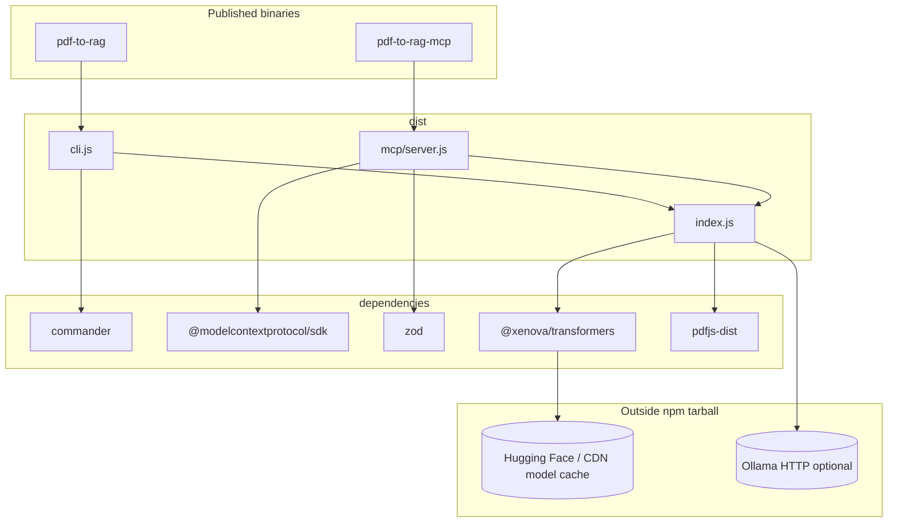

# Requirements

Specification and traceability for **pdf-to-rag**: CLI, library, MCP server, and documentation. The package is **intended for the public npm registry** under the name `pdf-to-rag` (see [npm publication](#public-npm-package)). Requirement IDs (F, N, D) are stable references for planning and PRs.

## Project scope

| Area | Description |
|------|-------------|
| **In scope** | Local ingest of PDFs → page text → clean → chunk → embed → JSON index; semantic **query** returning **verbatim chunk excerpts** with **file + page** (and score/chunk id) so clients can **validate** retrieval and **quote** evidence; optional MCP exposure for AI clients. |
| **Out of scope (MVP)** | Paid cloud LLM/embeddings APIs, incremental reindex, HTTP/SSE MCP transport (see [roadmap](./roadmap.md) Phase 3). Automatic migration of indexes between embedding backends (operators **re-ingest** when switching). |
| **Out of scope (product)** | OCR for scanned PDFs, guaranteed layout fidelity, sub-second search at very large scale without swapping the vector store. **Generative “answers”** that synthesize prose beyond retrieved passages (no bundled LLM); hosts may compose answers **using** returned excerpts as quotations. |

## Dependencies

### Runtime and environment

| Dependency | Version / note | Why it matters |
|------------|----------------|----------------|
| **Node.js** | `>=18` (`package.json` `engines`) | ESM, `import.meta`, pdfjs / MCP SDK expectations. |
| **Disk** | ~100MB+ for default embedding model cache | First ingest or query downloads `Xenova/all-MiniLM-L6-v2` via Transformers.js unless already cached. |
| **Network** | Required **once** (or when cache cleared) for Transformers default | Model fetch from Hugging Face / CDN; no runtime API keys. Optional offline if models are pre-cached (`TRANSFORMERS_CACHE`). **Ollama path:** no HF fetch for embeddings; requires a reachable **local** Ollama HTTP server and a pulled embed model (`ollama pull …`). |
| **Memory / CPU** | Moderate during ingest and embed | Default: ONNX inference (CPU-oriented in this stack) and PDF parsing; large folders increase peak usage. **Ollama fast path:** embedding throughput depends on Ollama’s use of **GPU or Apple Metal**; CPU-only Ollama may be much slower. |

### npm: runtime (`dependencies`)

| Package | Role |
|---------|------|
| `@modelcontextprotocol/sdk` | MCP stdio server, tools, Zod integration. |
| `@xenova/transformers` | Local feature-extraction embeddings (same model ingest + query). |
| `pdfjs-dist` | Page-level PDF text extraction (legacy build + worker in Node). |
| `commander` | CLI argument parsing. |
| `zod` | MCP tool input/output schemas. |

### npm: development (`devDependencies`)

| Package | Role |
|---------|------|
| `typescript` | Compile `src/` → `dist/`. |
| `tsx` | Run CLI from source during development (`npm run dev`). |
| `@types/node` | Node typings. |

### External expectations (no package)

| Expectation | Detail |
|-------------|--------|
| **PDFs** | Text-based PDFs extract best; image-only pages may yield empty text. |
| **MCP hosts** | Cursor, Claude Desktop, etc. must support stdio MCP servers; user configures command + env (see [use/mcp.md](../use/mcp.md)). |
| **Ollama (optional fast path)** | Local HTTP API (default `http://127.0.0.1:11434`) when `PDF_TO_RAG_EMBED_BACKEND=ollama`. Operators choose a **trusted** base URL; embeddings are sent to that service (see **F7**, [use/mcp.md](../use/mcp.md)). |

### Dependencies by embedding path

The **same** npm tarball and pipeline run on all paths; only **runtime** dependencies differ after install.

| Path | Hard npm dependency | External runtime dependency | When it loads |
|------|---------------------|----------------------------|---------------|
| **Transformers (default)** | `@xenova/transformers` | Hugging Face / CDN (or pre-filled `TRANSFORMERS_CACHE`) for first model fetch | First `createTransformersEmbedder` use in a process (ingest/query via `createAppDeps`). |
| **Ollama (optional)** | None beyond Node `fetch` (built-in) | [Ollama](https://ollama.com) daemon reachable at `OLLAMA_HOST`; embed model pulled (`ollama pull <model>`) | Every batched `/api/embed` or parallel `/api/embeddings` call during ingest/query. |

**Shared** (both paths): `pdfjs-dist` for PDF text extraction, `@modelcontextprotocol/sdk` + `zod` for MCP, `commander` for CLI. Neither path adds paid cloud APIs.

**Why two embedding paths:** Transformers.js in Node uses ONNX on CPU for the default stack—correct and air-gap-friendly, but **throughput scales poorly** when chunk counts are very large (e.g. many long PDFs under `examples/`). Ollama can use GPU or Apple Metal and accepts **batched** embed requests, which is the primary lever for the **~5 minute** design target at that scale (**N3**).

### Dependency and entrypoint graph

How published **binaries** and **libraries** relate to npm packages and external services:

## Deliverables

What the project is expected to produce and ship.

| Deliverable | Location / artifact | Notes |
|-------------|----------------------|--------|
| **CLI** | `pdf-to-rag` binary → `dist/cli.js` | `ingest`, `query`, `inspect`. Honors **`PDF_TO_RAG_EMBED_BACKEND`** and **`OLLAMA_*`** via `createAppDeps` (same as library/MCP). |
| **Library** | `dist/index.js` + types | `createAppDeps`, `runIngest`, `runQuery`, `runInspect`, config, hooks, pipeline exports; **`createTransformersEmbedder`**, **`createOllamaEmbedder`**, **`Embedder`** for advanced use. |
| **MCP server** | `pdf-to-rag-mcp` binary → `dist/mcp/server.js` | Tools: `ingest`, `query`, `inspect`; structured JSON results. Embedding backend is **env-driven** (document in host `mcp.json`). |
| **Vector index** | User-chosen dir (default `.pdf-to-rag/index.json`) | JSON v1; full reindex on each `ingest` (MVP). `embeddingModel` records **`Xenova/…`** or **`ollama:<model>`** for traceability (**F7**). |
| **Documentation** | `README.md`, `docs/**` | Install, MCP config, security, architecture, **embedding env vars**, **query validation / quotation-oriented output** (see **F2**, **F8**, **D5**), contributor Cursor setup. |
| **Published package** | `npm pack` / public registry | `files`: `dist`, `README.md`, `docs` (see `package.json`). Built output only; see [Public npm package](#public-npm-package). |

### Deliverables: embedding and performance (implemented)

These items satisfy **F7**, **N1** (Ollama branch), and the **Embedding backends + examples-scale perf** milestone in [roadmap.md](./roadmap.md).

| Deliverable | Code / doc location | What it does |
|-------------|---------------------|--------------|
| Ollama embedder | `src/embedding/ollama.ts` | `POST /api/embed` with batched `input`; on **404**, falls back to parallel `POST /api/embeddings` with **`OLLAMA_EMBED_CONCURRENCY`**; L2-normalizes vectors for cosine search. |
| Transformers embedder | `src/embedding/transformers.ts` | Hugging Face id via `@xenova/transformers` `feature-extraction`; small internal batches; unchanged default behavior. |
| Public barrel | `src/embeddings.ts` | Re-exports types and factories; **`createEmbedder`** → Transformers for backward compatibility. |
| Factory wiring | `src/application/factory.ts` | Reads **`PDF_TO_RAG_EMBED_BACKEND`**; Ollama branch requires **`OLLAMA_EMBED_MODEL`**, uses **`OLLAMA_HOST`**, sets store **`embeddingModel`** to **`ollama:<model>`**, merges into `PdfToRagConfig`. |
| Dimension guard | `src/storage/file-store.ts` | **`search`** throws if query vector length ≠ stored chunk embedding length (wrong backend/model without re-ingest). |
| Operator docs | `README.md`, `docs/use/mcp.md`, `docs/onboarding/mcp.md`, `examples/README.md`, `docs/architecture/overview.md`, `docs/use/cli-library.md` | Env tables, large-corpus guidance, **~5 min** target caveats (GPU/Metal). |
| Cursor metadata | `.cursorrules`, `.cursor/rules/pdf-to-rag.mdc`, `.cursor/commands/pdf-embeddings.md`, `.cursor/skills/pdf-rag-*.md`, `.cursor/agents/pdf-*.md`, `docs/contributing/agents.md` | **`/pdf-embeddings`**, skills mention Ollama env and security. |

### Status: done vs remaining (embedding / performance)

| Area | Status | Notes |
|------|--------|--------|
| Dual backend (Transformers + Ollama) | **Done** | Env-based; no new npm dependency for HTTP. |
| Batching + legacy fallback + tuning env | **Done** | **`OLLAMA_EMBED_BATCH_SIZE`**, **`OLLAMA_EMBED_CONCURRENCY`**. |
| Index + query consistency | **Done** | Synthetic **`ollama:`** model id; dimension check on search. |
| Docs + traceability | **Done** | **F7**, **N3**, milestone row in roadmap, examples README. |
| **Measured** benchmark on `examples/` | **Open** | Run **`time`** (or equivalent) full ingest with Ollama + recommended model on a defined machine class; append results to [examples/README.md](../../examples/README.md) or this file (**N3**). |
| Parallel PDF extraction per file | **Deferred** | Optional follow-up if profiling shows PDF/chunk stages dominate after Ollama is enabled; not required for current milestone. |
| Incremental reindex / index migration | **Out of scope** | Full re-ingest when switching backends or models (**F7**). |

## Public npm package

The repo builds a **publishable** artifact. Consumers may never clone the repository.

| Aspect | Expectation |
|--------|-------------|
| **Package name** | `pdf-to-rag` in `package.json` `name`. If the name is taken on npm, maintainers choose a scoped name (`@scope/pdf-to-rag`) and update this doc + README. |
| **Registry** | Target is the **public** npm registry so anyone can `npm install` / `npx` without private auth. |
| **What ships** | Only paths in `package.json` **`files`**: `dist`, `README.md`, `docs`. Not shipped: `src/`, `.cursor/`, `.hooks/`, `scripts/` (except what npm includes by default—none of these are in `files`). |
| **Pre-publish** | `prepublishOnly` runs `npm run build`; published tarballs must contain a fresh `dist/`. |
| **Install surfaces** | Must stay documented for registry users: global CLI (`npm install -g pdf-to-rag`), **`npx pdf-to-rag …`**, programmatic **`import` from `'pdf-to-rag'`**, MCP via **`npx pdf-to-rag-mcp`** or `node …/node_modules/pdf-to-rag/dist/mcp/server.js`. |
| **Versioning** | [Semantic versioning](https://semver.org/): breaking changes to documented CLI flags, library exports, or MCP tool contracts → **major**; additive features → **minor**; fixes → **patch**. |
| **License** | `package.json` `license` (MIT) must match repository licensing intent. |

### npm consumers vs git contributors

| Audience | Gets | Dependencies |
|----------|------|--------------|
| **npm consumer** | Tarball contents + transitive `dependencies` only | Node 18+, disk/network for **Transformers** model cache unless using **Ollama** only; if using Ollama, must install and run Ollama separately and set env vars. No TypeScript compile step. |
| **Git contributor** | Full repo + `devDependencies` | `npm install`, `npm run build`, optional `.hooks`, Cursor tooling per [contributing/agents.md](../contributing/agents.md). For fast-path testing: local Ollama + pulled embed model. |

## Expectations

### For npm consumers (install from registry)

- Follow **README** on the npm package page (same as repo root README): install mode (`-g` vs `npx` vs library), Node version, first-run model download, MCP env vars.
- **MCP:** Point the host at the **installed** `dist/mcp/server.js` under `node_modules/pdf-to-rag/` or use `npx pdf-to-rag-mcp` from a directory where the package is installed.

### For end users

- **Local-first:** No account or API key required for embeddings; behavior is deterministic given same inputs and model cache.
- **Natural-language questions:** **`query`** accepts a full **question** string (e.g. *“What are the chemicals that impact the brain the most?”*), not only keywords. Retrieval ranks **passages** (chunks) by embedding similarity; there is no bundled step that rewrites the question or synthesizes a single prose “answer.”
- **Citations, quotations, and match metadata:** Each hit includes **verbatim excerpt** (`text`) plus **file name**, **page**, and **score** (and chunk id where exposed)—suitable for **quotes** in a report or UI. The **number of matches returned** is the length of the **`hits`** array (MCP **`data.hits`**, library **`QueryHit[]`**); **`topK`** caps how many are returned. **CLI** surfaces an explicit **match count** line before listing passages (**F9**). **`inspect`** reports **total chunks** in the index (corpus size), which is separate from “how many hits this query returned.”
- **Validating queries:** After ingest, use **`inspect`** then **`query`** (CLI or MCP) with the same **`storeDir`** and embedding env as ingest; **`npm run examples:smoke`** ingests the smallest `examples/` PDF, runs a **natural-language** CLI **`query`**, and asserts citation output plus the **match-count** summary line (see **F8**, **F9**, **N5**).
- **Cost of first run:** **Transformers:** expect download time and disk for the ONNX model; use `TRANSFORMERS_CACHE` for a fixed cache. **Ollama:** no Hugging Face embed download; ensure the daemon is running and the embed model is pulled (`ollama pull …`).
- **Security (MCP):** Operators should set `PDF_TO_RAG_ALLOWED_DIRS`, `PDF_TO_RAG_SOURCE_DIR`, and/or `PDF_TO_RAG_ROOT` deliberately when exposing the server beyond personal use (see [use/mcp.md § Security](../use/mcp.md#security)).

### For contributors

- **Architecture:** CLI and MCP are thin; orchestration lives in `src/application/`; pipeline stages stay separate modules (see `.cursor/rules/pdf-to-rag.mdc` and [architecture/overview.md](../architecture/overview.md)).
- **When behavior changes:** Update this file if F/N/D rows change; run `/pdf-update-docs` or follow `pdf-rag-docs-sync` skill to refresh `README.md` and `docs/`.
- **Verification:** `npm run build`; for MCP changes, `npm run mcp:smoke`; with PDFs in `examples/`, `npm run examples:smoke` (validates **query** output: NL question path, **match-count** line, citations, non-empty ranked hits). Optional **`npm run examples:fixtures`** with JSON for NL + substring expectations ([examples README § Query fixtures](../examples/README.md#json-fixtures-nl-queries-and-expected-quotations)). For manual validation of a full index, run **`query`** and confirm excerpts match corpus and citations (**F8**). Optional future: golden **chunkId** tests per [roadmap § Query validation](./roadmap.md#query-validation-quotation-ready-retrieval-and-testing).
- **Git hooks (optional):** `npm run hooks:install` enables `.hooks/pre-commit` (`npm run build` before each commit). See [`.hooks/README.md`](../../.hooks/README.md).

### For maintainers (releases)

- **Before publish:** `npm run build`, `npm pack --dry-run` and confirm only `dist`, `README.md`, `docs` are included; run smoke checks you rely on (e.g. `mcp:smoke` from repo).
- **Version:** Bump `package.json` `version` per semver; tag releases in git if the repo uses tags.
- **Registry users:** README and `docs/` must read correctly **without** assuming a clone (paths like “from this repo” should stay secondary to `npx` / global install).

---

## Functional (traceability)

| ID | Requirement |
|----|-------------|
| F1 | MCP tools map to capabilities: `ingest` (folder + optional overrides), `query` (question + optional topK/store), `inspect` (index stats). |
| F2 | Tool responses return structured JSON with citations: **`text`** (verbatim chunk excerpt from the indexed PDF pipeline), **`fileName`**, **`page`**; optional **`chunkId`**, **`score`**. The same fields apply to library **`QueryHit`** / CLI query output so behavior is consistent across surfaces. |
| F8 | **Query validation and quotation-ready retrieval:** (1) **`query`** (CLI, library, MCP) returns ranked hits whose **`text`** is the **stored chunk string** (suitable for direct quotation with citation), not a paraphrase. (2) **Minimum automated check:** **`npm run examples:smoke`** runs ingest + natural-language **`query`** and asserts stdout contains citation markers (`page`, `score=`) and the CLI **match-count** summary (`Returned` / `passage`, `topK=`). (3) Operators validate end-to-end by **`inspect`** → **`query`** on a known corpus; same **`storeDir`** and embedding backend as ingest. (4) **JSON fixtures:** **`npm run examples:fixtures`** reads **`examples/query-fixtures.json`**, ingests the configured corpus, and checks NL cases against **similarity-ranked** chunk text (full index per case for substring assertions; distinct from CLI **`topK`** cap)—see [examples README § Query fixtures](../examples/README.md#json-fixtures-nl-queries-and-expected-quotations). (5) **Open / stretch:** MCP **`query`** in **`mcp:smoke`**, golden **chunkId** tests—see [roadmap](./roadmap.md#query-validation-quotation-ready-retrieval-and-testing). |
| F9 | **Natural-language questions and match metadata:** (1) **`query`** input is a **natural language question or phrase**; behavior is semantic search over chunks, not exact-match keyword search only. (2) **Match count:** The number of results returned equals **`hits.length`** (bounded by **`topK`**). MCP **`query`** success payload **`data.hits`** must be an array whose **length** is that count; library consumers use the length of **`QueryHit[]`**. (3) **CLI** prints an explicit summary line stating **how many passage(s)** were returned (and may note **`topK`**), before printing each quoted excerpt with citation headers. (4) **Out of scope:** A single generated “answer” paragraph that merges hits; hosts or LLMs may compose that **using** the returned quotes and citations. |
| F3 | Defaults align with library config (`defaultConfig` / `src/config/defaults.ts`). |
| F4 | Working directory and store layout configurable via environment (and documented). |
| F5 | Primary transport is **stdio**; HTTP/SSE deferred unless needed. |
| F6 | **`PDF_TO_RAG_SOURCE_DIR`:** optional absolute corpus path; added to allowed roots; MCP `ingest` may omit `path` and use this directory; if `path` is omitted and the env is unset, respond with **`INVALID_INPUT`**. |
| F7 | **Embedding backend (env):** default **Transformers.js** (`createTransformersEmbedder`, config `embeddingModel`). Optional **`PDF_TO_RAG_EMBED_BACKEND=ollama`** with **`OLLAMA_EMBED_MODEL`** required and **`OLLAMA_HOST`** optional (default `http://127.0.0.1:11434`). Index stores `embeddingModel` as **`ollama:<model>`** vs Hugging Face id for Transformers. **Re-ingest** after changing backend or model. **Query** fails with a clear error if the query embedding length does not match stored vectors (dimension mismatch). Tunable **`OLLAMA_EMBED_BATCH_SIZE`** / **`OLLAMA_EMBED_CONCURRENCY`** for Ollama throughput. |

## Non-functional / security

| ID | Requirement |
|----|-------------|
| N1 | No paid APIs; local embeddings and JSON index only. **Optional** local **Ollama** HTTP embedding backend (same machine or trusted network) is in scope; paid cloud embedding APIs remain out of scope. |
| N2 | Filesystem paths accepted by tools are validated against configured allowed roots (see [use/mcp.md § Security](../use/mcp.md#security)). |
| N3 | Long-running ingest and first model download are documented; resource expectations explicit. **Performance:** default Transformers.js ingest can be **slow** for large multi-PDF corpora (many chunks, CPU ONNX). The **Ollama** path targets much faster ingest when Ollama uses **GPU or Apple Metal** and a lightweight embed model (e.g. `nomic-embed-text`); **~5 minutes** full ingest for an `examples/`-scale corpus is a **design target** under that setup, not guaranteed on CPU-only Ollama or without tuning. Operators may record timings on their hardware in [examples/README.md](../../examples/README.md) when benchmarking. |
| N4 | MCP server exposes package version; index file remains JSON v1. |
| N5 | **Retrieval traceability:** Query path is **retrieve-then-rank** (cosine on stored embeddings); there is no hidden rewrite of chunk text before return. Downstream “answers with quotations” rely on this contract; changing chunk boundaries or normalization affects quotability and should be documented in release notes when material. |

## Documentation

| ID | Requirement |
|----|-------------|
| D1 | MCP overview, install/run, client config examples, security, troubleshooting ([use/mcp.md](../use/mcp.md)). |
| D2 | Roadmap maintained in [roadmap.md](./roadmap.md). |
| D3 | This requirements document kept in sync when behavior or dependencies change materially. |
| D4 | **npm:** README (and key `docs/**`) describe install from the **registry** (`npm i -g`, `npx`, library import, `npx pdf-to-rag-mcp`) without requiring a git clone as the only path. |
| D5 | **Query validation and quotations:** `docs/use/cli-library.md` and/or root **README** describe how to run **`inspect`** / **`query`** after ingest, **`--store-dir`**, embedding env parity, and that hit **`text`** is **verbatim** excerpt for citations; explain **NL questions**, **`hits.length`** / **match count**, **`topK`**, and **`inspect`** chunk total; link **`examples:smoke`** and [roadmap query-validation](./roadmap.md#query-validation-quotation-ready-retrieval-and-testing). MCP: align with **F2** / **F8** / **F9** in `docs/use/mcp.md` (**`data.hits`** array length). |
