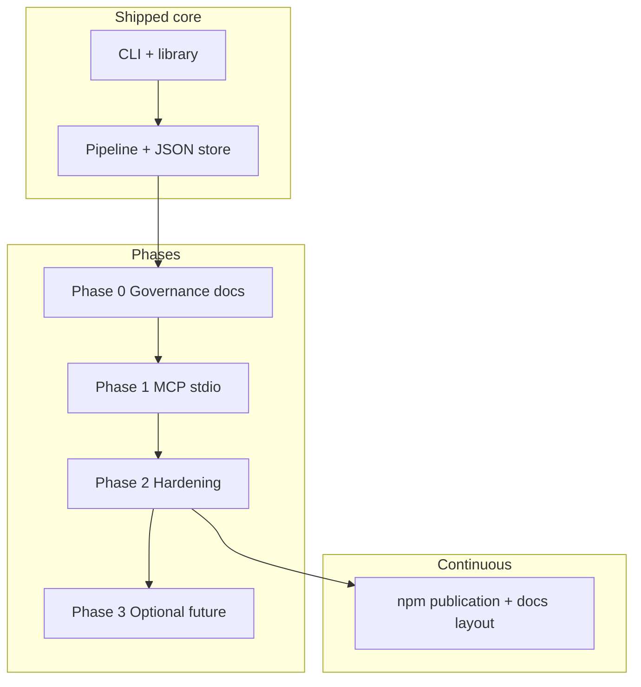
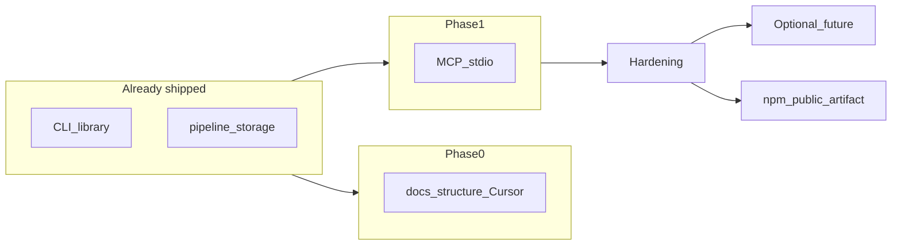

# Roadmap

Phased delivery for **pdf-to-rag**, aligned with [requirements](./requirements.md) (dependencies, deliverables, expectations). The product is a **public npm package** (`pdf-to-rag`), not only a source tree; phases below include what registry consumers need.

## Outcomes we optimize for

| Outcome | Success looks like |
|---------|-------------------|
| **Usable locally** | Ingest a folder of PDFs and **query** with **verbatim excerpts** and correct **file + page** citations so answers can **quote** evidence; validate with **`inspect`**, **`query`**, and **`examples:smoke`** (see [Query validation](#query-validation-quotation-ready-retrieval-and-testing)). |
| **Embeddable** | Same behavior via **library** import or **MCP** tools, not duplicate pipelines. |
| **Installable from npm** | Anyone can use **CLI**, **library**, and **MCP** via `npm install` / `npx` without cloning; tarball matches `package.json` `files` and [requirements § Public npm package](./requirements.md#public-npm-package). |
| **Understandable** | Contributors know what ships in the package vs repo-only; docs under `docs/management`, `docs/architecture`, `docs/use`, and `docs/onboarding` stay aligned with code. |

## Phase dependency overview

Phases assume the **runtime stack** in [requirements.md § Dependencies](./requirements.md#dependencies): Node 18+, npm packages in `package.json`, first-run Transformers model download (default path), optional **`TRANSFORMERS_CACHE`**, optional **Ollama** for a faster embedding path (`PDF_TO_RAG_EMBED_BACKEND`, `OLLAMA_EMBED_MODEL`, `OLLAMA_HOST`, batch/concurrency tunables), and MCP env vars (`PDF_TO_RAG_CWD`, `PDF_TO_RAG_ALLOWED_DIRS`, `PDF_TO_RAG_ROOT`, `PDF_TO_RAG_SOURCE_DIR`).

**Cross-cutting dependency:** `createAppDeps` in `src/application/factory.ts` is the single place that chooses the embedder. CLI, library, and MCP all depend on it—no duplicate embedding logic in `src/mcp/` or `src/commands/`.

The **npm public artifact** outcome is continuous: `prepublishOnly`, `files`, and docs (D4) stay aligned with each release.

---

## Phase 0 — Governance

**Goal:** Contributor and operator docs; Cursor rules/skills/commands; no change to core RAG behavior.

**Dependencies:** None beyond repo checkout and Node for doc tooling if needed.

**Deliverables:**

- `docs/README.md` (index), `docs/management/requirements.md`, `docs/management/roadmap.md`, `docs/contributing/agents.md`, `docs/use/mcp.md` (baseline); later expanded with `docs/architecture/`, `docs/onboarding/`, `docs/use/cli-library.md`.
- `.cursor/rules/`, optional `.cursor/commands/`, `.cursor/agents/`, `.cursor/skills/`, `.cursorrules`.
- Root `README.md` links to `docs/`.

**Status:** done (doc layout may evolve; keep index current).

---

## Phase 1 — MCP MVP

**Goal:** Expose ingest / query / inspect over MCP stdio using the existing application API.

**Dependencies:** `@modelcontextprotocol/sdk`, `zod`; path policy env vars documented in `docs/use/mcp.md`.

**Deliverables:**

- `pdf-to-rag-mcp` binary (`dist/mcp/server.js`).
- Tools: `ingest`, `query`, `inspect` → `createAppDeps` + `runIngest` / `runQuery` / `runInspect`.
- Allowlisted paths via `PDF_TO_RAG_*` environment variables.
- Operator onboarding: [onboarding/mcp.md](../onboarding/mcp.md) (verify build, Cursor config, first tool sequence).

**Status:** done.

---

## Phase 2 — Hardening

**Goal:** Predictable tool errors and quick local verification.

**Dependencies:** Same as Phase 1; `scripts/mcp-smoke.mjs` uses SDK client.

**Deliverables:**

- Structured tool results (`ok` / `error.code` / `error.message`, `version`).
- `npm run mcp:smoke`.
- Expanded troubleshooting in `docs/use/mcp.md`.

**Status:** done.

---

## npm publication (cross-cutting)

**Goal:** The package on the public registry is the default way to adopt **pdf-to-rag**; the repo remains the place for development and Cursor tooling.

**Dependencies:** npm account and available package name (or scoped name); see [requirements § Public npm package](./requirements.md#public-npm-package).

**Deliverables / ongoing:**

- `package.json`: `bin`, `exports`, `files`, `engines`, `prepublishOnly` (already present).
- README and docs satisfy **D4** (registry-first install paths).
- Maintainers follow [requirements § For maintainers (releases)](./requirements.md#for-maintainers-releases) before `npm publish`.

**Status:** ongoing with every release (not a separate numbered phase gate).

---

## Phase 3 — Optional (not prioritized)

**Goal:** Only if there is concrete product demand.

**Candidate deliverables:**

- Incremental re-indexing (avoid full index rewrite on each ingest).
- Secondary MCP transport (SSE/HTTP) for hosts that cannot use stdio.

**Dependencies:** TBD per design; would add new requirements (new F/N IDs) before implementation.

**Status:** deferred.

---

## Milestone: Embedding backends + examples-scale perf

This milestone is **tracked in code and docs** as of the **F7** / **N3** updates in [requirements.md](./requirements.md). It is **not** a numbered phase (Phases 0–2 remain closed); it is a **product + performance** slice that ships inside the same npm artifact.

### Goal

Keep **Transformers.js** as the **zero-extra-service default**, and add an **optional Ollama** path so a large multi-PDF corpus (e.g. `examples/` scale) can ingest in **~5 minutes wall time** when Ollama uses **GPU or Apple Metal** and a lightweight embed model—versus **on the order of tens of minutes** on the default CPU ONNX path for the same chunk volume.

### Dependencies (what must be true)

| Dependency | Role | Owner |
|------------|------|--------|
| **Node 18+** | ESM, `fetch` for Ollama HTTP | Operator / CI |
| **`@xenova/transformers`** (npm) | Default embedder; still required in `package.json` for air-gapped / no-Ollama installs | Package |
| **Ollama** (external binary) | Serves `/api/embed` and/or `/api/embeddings`; GPU/Metal improves throughput | Operator |
| **Pulled embed model** | e.g. `nomic-embed-text`; dimensions must stay consistent for ingest + query | Operator (`ollama pull`) |
| **Env vars** | `PDF_TO_RAG_EMBED_BACKEND=ollama`, `OLLAMA_EMBED_MODEL`, optional `OLLAMA_HOST`, `OLLAMA_EMBED_BATCH_SIZE`, `OLLAMA_EMBED_CONCURRENCY` | MCP host / shell / CI |
| **Re-ingest discipline** | Switching backend or model changes vector space; no automatic migration | Operator |

### Deliverables (implementation checklist)

| Deliverable | Status | Evidence in repo |
|-------------|--------|------------------|
| Batched Ollama embed + legacy fallback + L2 normalize | **Done** | `src/embedding/ollama.ts` |
| Transformers embedder in dedicated module | **Done** | `src/embedding/transformers.ts` |
| Public exports (`createOllamaEmbedder`, `createTransformersEmbedder`, `Embedder`) | **Done** | `src/embeddings.ts`, `src/index.ts` |
| Factory branch + `ollama:<model>` index id | **Done** | `src/application/factory.ts` |
| Query/index dimension guard | **Done** | `src/storage/file-store.ts` |
| Requirements **F7**, **N1**, **N3** + dependency tables | **Done** | [requirements.md](./requirements.md) |
| User docs (README, MCP, onboarding, examples, architecture, cli-library) | **Done** | `README.md`, `docs/use/*`, `docs/onboarding/*`, `examples/README.md`, `docs/architecture/overview.md` |
| Cursor: `.cursorrules`, `pdf-to-rag.mdc`, **`/pdf-embeddings`**, skills, agents | **Done** | `.cursor/**`, [contributing/agents.md](../contributing/agents.md) |

### Remaining / follow-up (not blocking “shipped”)

| Item | Priority | Description |
|------|----------|-------------|
| **Recorded benchmark** | Medium | Timed full `examples/` ingest with Ollama + stated hardware (e.g. M-series + Metal); append to [examples/README.md](../../examples/README.md) or [requirements § N3](./requirements.md#non-functional--security). |
| **Parallel PDF extraction** | Low | Only if profiling shows extract/chunk dominates after Ollama; optional optimization. |
| **Phase 3 items** | Deferred | Incremental reindex, SSE MCP—see [Phase 3](#phase-3--optional-not-prioritized). |

---

## Query validation, quotation-ready retrieval, and testing

Cross-cutting concern aligned with [requirements **F2**, **F8**, **F9**, **N5**, **D5**](./requirements.md#functional-traceability): the product is **retrieval-first**—`query` accepts **natural-language questions** (e.g. about chemicals and the brain) and returns **ranked chunks** whose **`text`** is **verbatim** content from the ingest pipeline (not LLM paraphrase). **Answering with quotations** means presenting those excerpts as **quotes** with **file + page** (and **score**), and surfacing **how many passages** matched (**`hits.length`**, capped by **`topK`**). **`inspect`** still reports **total indexed chunks** (corpus size), which is not the same as per-query match count. A single synthesized “answer” paragraph is **out of scope** unless a host composes it from returned hits (**F9**).

### Current state

| Item | Status | Notes |
|------|--------|--------|
| Verbatim **`text`** on hits | **Done** | Library / CLI / MCP share the same `QueryHit` shape (**F2**). |
| Citation fields (`fileName`, `page`, …) | **Done** | Exposed on all surfaces. |
| NL questions + **match count** in API | **Done** | **`hits.length`** / **`data.hits`.length** (**F9**). |
| **CLI** explicit “N passage(s)” line | **Done** | [`src/commands/query.ts`](../../src/commands/query.ts): summary before excerpts (**F9**); empty index path prints **topK** and “No passages returned”. |
| Automated ingest + **query** check | **Done** | [`npm run examples:smoke`](../../scripts/examples-smoke.mjs): smallest `examples/` PDF, **natural-language** question, asserts `Returned` / `passage` / `topK=` plus `page` and `score=`; store **`.pdf-to-rag-examples-smoke`**. |
| NL query normalization (trim / whitespace) | **Done** | [`src/query/search.ts`](../../src/query/search.ts) `normalizeQueryText` before `embedOne` (exported for tests or callers). |
| **`mcp:smoke`** includes **`query`** | **Open** | [`scripts/mcp-smoke.mjs`](../../scripts/mcp-smoke.mjs) today only **`ingest`**s an empty corpus; extending it with a tiny PDF + **`query`** would validate the MCP JSON path (**F8** stretch). |
| Post–full-ingest scripted questions | **Partial** | [`npm run examples:fixtures`](../../scripts/examples-query-fixtures.mjs) + committed [`examples/query-fixtures.json`](../../examples/query-fixtures.json): NL cases, substring expectations; runner ranks **all** chunks per case for assertions. See [examples README § Query fixtures](../../examples/README.md#json-fixtures-nl-queries-and-expected-quotations). Optional `scripts/query-smoke.mjs` or golden **chunkId** tests still open. |
| Unit tests (`node:test` / Vitest) | **Open** | e.g. cosine / dimension guard / fixture index (**N5** supports stable contracts). |

### Fixture harness (plan / risks)

| Milestone | Done when |
|-----------|-----------|
| **M1 — Fixture file in repo** | **`examples/query-fixtures.json`** is the single NL/substring suite; **`examples:fixtures`** passes when `examples/` PDFs match the quoted strings. |
| **M2 — Harness behavior** | Full-corpus **similarity-ranked** hit list for substring checks; optional **`pinnedFiles`**, **`textContainsInCorpus`**, **`minDistinctFiles`**, apostrophe normalization (default on), **`--verbose`** ([`scripts/examples-query-fixtures.mjs`](../../scripts/examples-query-fixtures.mjs)). |
| **M3 — Optional strictness** | Open: deterministic **`chunkId`** expectations after ingest, or MCP **`query`** in **`mcp:smoke`**. |

**Risks:** Fixture substring checks scan the **full ranked list** (not CLI **`topK`**). **Unicode** / PDF extraction must match strings or use **`relaxApostrophes`** (default on; set **`false`** for strict bytes). **Ollama vs Transformers** changes ordering but not which chunks exist (**F7**).

### Dependencies

- **Same as query path:** `createAppDeps`, index at resolved **`storeDir`**, embedding env parity with ingest (**F7**).
- **Docs:** **D5** — operators need **`inspect` → `query`** guidance and explicit **quotation** semantics in [`docs/use/cli-library.md`](../use/cli-library.md), **README**, [`docs/use/mcp.md`](../use/mcp.md).

### Deliverables (documentation and QA)

| Deliverable | Target | Traceability |
|-------------|--------|----------------|
| README / cli-library: validate query, verbatim excerpts | **D5** | Link **`examples:smoke`**, **`storeDir`**, Ollama env |
| Requirements **F8**, **F9**, **N5**, **D5** | **Done** | [requirements.md](./requirements.md) |
| MCP **`query`** in smoke (optional) | Stretch | **F8** |

---

## Milestones (changelog-style)

| Milestone | Deliverables / notes |
|-----------|----------------------|
| **0.1.0** | CLI + library + JSON vector store + ingest/query pipeline; package metadata prepared for npm (`bin`, `files`, `prepublishOnly`). |
| **0.1.x** | MCP server, structured errors, `mcp:smoke`, Cursor tooling, skills/commands refactor, expanded requirements; docs reorganized under `docs/*` subfolders. |
| **First `npm publish`** | Public registry listing; verify `npm pack` contents; README/D4 validated from a clean `npm install` (no clone). |
| **0.2.x+** | Ongoing semver releases; breaking CLI/library/MCP contract changes bump major per [requirements](./requirements.md#public-npm-package). |
| **Embedding backends + examples-scale perf** | **Shipped** in source: optional **Ollama** embedder (batched `/api/embed`, fallback `/api/embeddings`, env tunables), index `embeddingModel` **`ollama:<model>`**, **dimension mismatch** guard on search. **Target:** ~**5 min** full ingest for `examples/`-scale corpus with Ollama on **GPU/Metal** + lightweight embed model; Transformers default remains slower at that scale. Detailed checklist: [Milestone: Embedding backends + examples-scale perf](#milestone-embedding-backends--examples-scale-perf). Traceability: [requirements § F7 / N3](./requirements.md#functional-traceability), [examples/README.md](../../examples/README.md). |
| **Query validation + quotation-ready retrieval** | **Specified** in [requirements **F2**, **F8**, **F9**, **N5**, **D5**](./requirements.md#functional-traceability): NL questions, **quotes** (verbatim **`text`**), **match count** (**`hits.length`**, **topK**), corpus size via **`inspect`**. **`examples:smoke`** + **`examples:fixtures`** (JSON; see [fixture harness](#fixture-harness-plan--risks)). **Open:** MCP **`query`** in **`mcp:smoke`**, golden **chunkId** tests. Detail: [Query validation, quotation-ready retrieval, and testing](#query-validation-quotation-ready-retrieval-and-testing). |

---

## Expectations (roadmap-level)

| Audience | Expectation |
|----------|-------------|
| **Registry users** | Primary path is `npm install` / `npx`; see [requirements § npm consumers](./requirements.md#for-npm-consumers-install-from-registry) and **D4**. |
| **Users (any install path)** | Read [requirements § Expectations](./requirements.md#expectations) for first-run cost, citations, and MCP security. |
| **Maintainers** | Phases 0–2 are **closed**; Phase 3 items require an explicit decision and spec update in `requirements.md`. Each publish follows release checklist in requirements. |
| **Releases** | `prepublishOnly` runs `npm run build`; published tarball includes only `dist`, `README.md`, `docs` per `package.json` `files`. |
