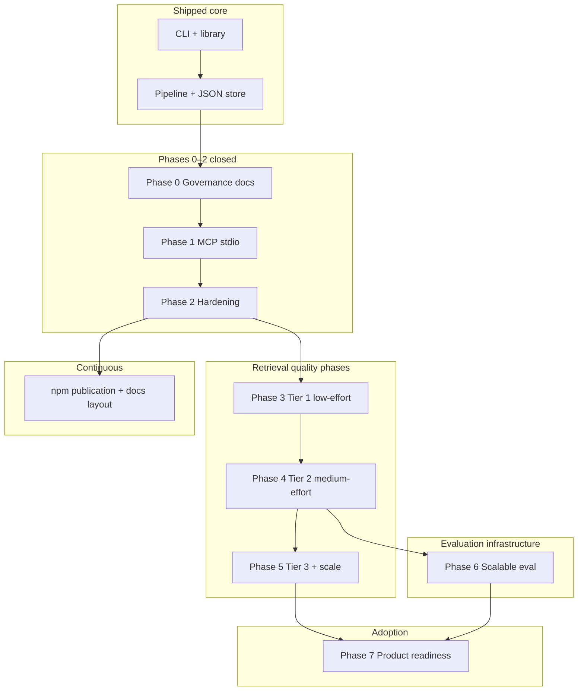
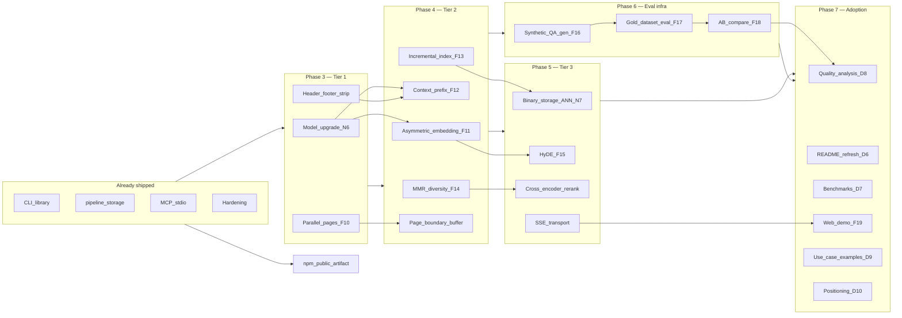

# Roadmap

Phased delivery for **pdf-to-rag** (public npm package **`pdf-to-rag`**). **[Requirements](./requirements.md)** hold **F** / **N** / **D** traceability, dependencies, and expectations. **[project.md](./project.md)** holds the **summary**, **outcomes**, **portfolio / adoption priorities**, **testing methodology**, and **embedding pipeline reference**. Sections below list **phases in numeric order** (0 → 7), plus **npm publication**, **embedding backends milestone**, **query validation**, and a **changelog-style milestone table**.

## Phase dependency overview

Phases assume the **runtime stack** in [requirements.md § Dependencies](./requirements.md#dependencies): Node 18+, npm packages in `package.json`, first-run Transformers model download (default path), optional **`TRANSFORMERS_CACHE`**, optional **Ollama** for a faster embedding path (`PDF_TO_RAG_EMBED_BACKEND`, `OLLAMA_EMBED_MODEL`, `OLLAMA_HOST`, batch/concurrency tunables), and MCP env vars (`PDF_TO_RAG_CWD`, `PDF_TO_RAG_ALLOWED_DIRS`, `PDF_TO_RAG_ROOT`, `PDF_TO_RAG_SOURCE_DIR`).

**Cross-cutting dependency:** `createAppDeps` / `createAppEmbedder` in `src/application/factory.ts` is the single place that chooses the embedder. CLI, library, and MCP all depend on it — no duplicate embedding logic in `src/mcp/` or `src/commands/`.

The **npm public artifact** outcome is continuous: `prepublishOnly`, `files`, and docs (D4) stay aligned with each release.

---

## Phase 0 — Governance

**Goal:** Contributor and operator docs; Cursor rules/skills/commands; no change to core RAG behavior.

**Dependencies:** None beyond repo checkout and Node for doc tooling if needed.

**Deliverables:**

- `docs/README.md` (index), `docs/management/requirements.md`, `docs/management/roadmap.md`, `docs/management/project.md`, `docs/contributing/agents.md`, `docs/use/mcp.md` (baseline); later expanded with `docs/architecture/`, `docs/onboarding/`, `docs/use/cli-library.md`.
- `.cursor/rules/`, optional `.cursor/commands/`, `.cursor/agents/`, `.cursor/skills/`, `.cursorrules`.
- Root `README.md` links to `docs/`.

**Status:** done (doc layout may evolve; keep index current).

---

## Phase 1 — MCP MVP

**Goal:** Expose ingest / query / inspect over MCP stdio using the existing application API.

**Dependencies:** `@modelcontextprotocol/sdk`, `zod`; path policy env vars documented in `docs/use/mcp.md`.

**Deliverables:**

- `pdf-to-rag-mcp` binary (`dist/mcp/server.js`).
- Tools: `ingest`, `query`, `inspect` → `createAppDeps` + `runIngest` / `runQuery` / `runInspect`.
- Allowlisted paths via `PDF_TO_RAG_*` environment variables.
- Operator onboarding: [onboarding/mcp.md](../onboarding/mcp.md) (verify build, Cursor config, first tool sequence).

**Status:** done.

---

## Phase 2 — Hardening

**Goal:** Predictable tool errors, a `search` tool for single-call Q&A, embedder singleton for the MCP process lifetime, and quick local verification.

**Dependencies:** Same as Phase 1; `scripts/mcp-smoke.mjs` uses SDK client.

**Deliverables:**

- Structured tool results (`ok` / `error.code` / `error.message`, `version`).
- `search` tool with auto-ingest from `PDF_TO_RAG_SOURCE_DIR` when index is empty.
- Embedder singleton cached across tool calls in the MCP server (`src/mcp/server.ts`).
- `minScore` filter applied before `topK` truncation (`src/storage/file-store.ts`).
- Word-boundary snapping in chunker; `_loaded` flag prevents double disk reads.
- `npm run mcp:smoke`.
- Expanded troubleshooting in `docs/use/mcp.md`.

**Status:** done.

---

## npm publication (cross-cutting)

**Goal:** The package on the public registry is the default way to adopt **pdf-to-rag**; the repo remains the place for development and Cursor tooling.

**Dependencies:** npm account and available package name (or scoped name); see [requirements § Public npm package](./requirements.md#public-npm-package).

**Deliverables / ongoing:**

- `package.json`: `bin`, `exports`, `files`, `engines`, `prepublishOnly` (already present).
- README and docs satisfy **D4** (registry-first install paths).
- Maintainers follow [requirements § For maintainers (releases)](./requirements.md#for-maintainers-releases) before `npm publish`.

**Status:** ongoing with every release (not a separate numbered phase gate).

---

## Phase 3 — Retrieval quality: Tier 1 (low effort)

**Goal:** Maximum retrieval quality improvement per unit of effort. No new npm dependencies. Ships as a minor version bump; operators must re-ingest after model change.

**Prerequisite:** Phase 2 done. Tier 1 model and extraction choices for this phase are **resolved** in shipped code; historical rationale and pre-implementation questions are in [project.md § Embedding and pipeline improvements](./project.md#embedding-and-pipeline-improvements-reference).

### Dependencies

| Dependency | Role | Owner |
|------------|------|-------|
| **Node 18+** | Unchanged | Operator / CI |
| **`@xenova/transformers`** | Loads new default model on first use | Package (no new npm dep) |
| **`TRANSFORMERS_CACHE`** | Persistent model cache across re-runs | Operator (recommended) |
| **Re-ingest discipline** | Model change invalidates existing index; operators must re-ingest (**F7**) | Operator |
| **pdfjs-dist** | Page-position metadata already available via `item.transform`; no upgrade needed | Package |

### Deliverables

| Deliverable | Requirement | Status | Location |
|-------------|-------------|--------|----------|
| Replace `Xenova/all-MiniLM-L6-v2` with `Xenova/all-mpnet-base-v2` (512-token, 768-dim) | **N6** | **Done** | `src/config/defaults.ts` |
| Update disk / memory estimate in requirements | **N6** | **Done** | `docs/management/requirements.md` |
| Operator migration note (re-ingest after model change) | **F7**, **N6** | **Done** | `docs/use/mcp.md`, `README.md` |
| Parallel page extraction in `extractPages` (bounded `Promise.all`, pool of 8) | **F10** | **Done** | `src/pdf/extract.ts` |
| Benchmark note: extraction time before / after | **N3** | Partial | `examples/README.md`, `docs/analysis/benchmarks.md` (CPU timings recorded; Ollama optional) |
| Position-aware header/footer filter in `textFromContent` | — | **Done** | `src/pdf/extract.ts` |
| `stripMargins` config option (default `true`); `--no-strip-margins` CLI flag; MCP `ingest` param | — | **Done** | `src/config/defaults.ts`, `src/cli.ts`, `src/mcp/server.ts` |
| Update `docs/management/requirements.md` with **F10**, **N6** | — | **Done** | `docs/management/requirements.md` |

### Risks

| Risk | Mitigation |
|------|-----------|
| New model dimensions differ from existing index | Dimension guard in `file-store.ts` catches mismatch at query time; re-ingest required |
| `Promise.all` on pages spikes memory for very large PDFs | Cap pool at 8 concurrent pages; test on both example PDFs |
| Header/footer y-position heuristic is PDF-dependent | Make threshold configurable; default to conservative value; document in troubleshooting |

**Status:** done — model upgraded, parallel extraction shipped, header/footer stripping shipped. Operator-facing notes: `docs/use/mcp.md`, `README.md`, `examples/README.md` (including a benchmarking how-to). **N3** measured evidence: **Transformers.js (CPU)** ingest + query timings in [docs/analysis/benchmarks.md](../analysis/benchmarks.md); **Ollama** wall times remain optional to append.

---

## Phase 4 — Retrieval quality: Tier 2 (medium effort)

**Goal:** Structural improvements to embedding quality and index freshness. No new npm runtime dependencies, but interface changes require a coordinated re-ingest across all items that touch embedding.

**Prerequisite:** Phase 3 done (model with adequate token limit must be in place before asymmetric prefixes are meaningful; parallel extraction must be done before page-boundary buffering).

### Dependencies

| Dependency | Role | Owner |
|------------|------|-------|
| **Phase 3 model upgrade** | Instruction-tuned models (Nomic, E5) require the 512-token or 8192-token tier | Phase 3 |
| **Phase 3 parallel extraction** | Page-boundary buffering builds on the updated extraction loop | Phase 3 |
| **`node:crypto`** | SHA-256 for file fingerprints; built-in Node, no new npm dep | Package |
| **`src/utils/hash.ts`** | Already provides SHA-256 for chunk IDs; reuse for file fingerprints | Package |
| **`src/utils/cosine.ts`** | Already provides cosine similarity; reuse for inter-chunk MMR computation | Package |
| **Re-ingest required** | Asymmetric prefixes and context prefix both change embedded vectors; one combined re-ingest covers both | Operator |
| **Index schema bump** | Incremental indexing requires JSON v2 (`sourceFiles` map); v1 indexes trigger automatic full re-ingest on first load | Package |

### Deliverables

| Deliverable | Requirement | Status | Location |
|-------------|-------------|--------|----------|
| `EmbedRole = "query" \| "passage"` + `role?` param on `Embedder` interface | **F11** | **Done** | `src/embedding/types.ts` |
| Prefix injection in `transformers.ts` via `PDF_TO_RAG_QUERY_PREFIX` / `PDF_TO_RAG_PASSAGE_PREFIX` | **F11** | **Done** | `src/embedding/transformers.ts` |
| Prefix injection in `ollama.ts` | **F11** | **Done** | `src/embedding/ollama.ts` |
| Pass `"passage"` from `runIngestPipeline` | **F11** | **Done** | `src/ingestion/pipeline.ts` |
| Pass `"query"` from `searchQuery` | **F11** | **Done** | `src/query/search.ts` |
| `[Document: name \| Page N]` context prefix on embed inputs (not stored text) | **F12** | **Done** | `src/ingestion/pipeline.ts` |
| `contextPrefix: boolean` config option (default `true`) | **F12** | **Done** | `src/config/defaults.ts` |
| `SourceFileFingerprint` type + `sourceFiles` map in index JSON (schema v2) | **F13** | **Done** | `src/storage/file-store.ts`, `src/storage/types.ts` |
| `replaceForFiles(relativePaths, newChunks, fingerprints)` store method | **F13** | **Done** | `src/storage/file-store.ts`, `src/storage/types.ts` |
| `getSourceFileFingerprints()` store method | **F13** | **Done** | `src/storage/file-store.ts`, `src/storage/types.ts` |
| mtime+size fingerprint check + skip logic in `runIngestPipeline` | **F13** | **Done** | `src/ingestion/pipeline.ts` |
| v1 → v2 migration in `load()` (clears fingerprints, triggers re-index on next incremental run) | **F13** | **Done** | `src/storage/file-store.ts` |
| `filesSkipped?` on `IngestResult`; CLI "N unchanged, skipped" note | **F13** | **Done** | `src/domain/results.ts`, `src/commands/ingest.ts` |
| `mmrSelect(candidates, queryVector, k, lambda)` function | **F14** | **Done** | `src/query/mmr.ts` |
| `mmr: boolean`, `mmrLambda: number` config options (defaults: `false`, `0.5`) | **F14** | **Done** | `src/config/defaults.ts` |
| MMR candidate pool (`topK * 3`) + `mmrSelect` wired into `searchQuery` | **F14** | **Done** | `src/query/search.ts` |
| `mmr` + `mmrLambda` params on MCP `query` and `search` tools | **F14** | **Done** | `src/mcp/server.ts` |
| Cross-page text accumulation (`chunkDocumentText`) — page boundary buffer | — | **Done** | `src/chunking/document.ts`, `src/ingestion/pipeline.ts` |
| `pageForOffset` helper for per-chunk page attribution | — | **Done** | `src/chunking/document.ts` |
| Update `requirements.md` with **F11**, **F12**, **F13**, **F14** | — | **Done** | `docs/management/requirements.md` |
| Operator docs: re-ingest guidance, new config options | — | **Done** | `docs/use/mcp.md`, `README.md`, `docs/use/cli-library.md` |

### Risks

| Risk | Mitigation |
|------|-----------|
| Asymmetric prefix format varies by model | Store prefix strategy in index header alongside `embeddingModel`; mismatch at query time is caught by dimension guard |
| Context prefix increases token count | Prefix is short (~10 tokens); validate against the 512-token model limit after prepending |
| Incremental index misses a changed file | Fall back to full re-ingest if fingerprint map is absent or corrupt |
| MMR default-off means low adoption | Document recommended `mmrLambda: 0.7` in MCP tool description; consider making it default in a later minor |
| Page-boundary buffering changes chunk IDs | Deterministic chunk IDs depend on `filePath + page + chunkIndex`; page attribution changes for cross-page chunks break existing index compatibility → require re-ingest |

**Status:** done — all embedding, indexing, diversity, and page-boundary features shipped; operator docs updated for incremental ingest, MCP `search`, `minScore` / MMR, and asymmetric prefix env vars.

---

## Phase 5 — Scale and advanced retrieval: Tier 3 (high effort)

**Goal:** Handle corpora > 10k chunks without degraded query latency; close the query-to-passage alignment gap for short and abstract questions; add a re-ranking stage for maximum precision. Secondary MCP transport (SSE/HTTP) also belongs here.

**Prerequisite:** Phase 4 done. Each item in this phase is independently deferrable; they do not all need to ship together.

### Dependencies

| Dependency | Role | Owner |
|------------|------|-------|
| **Phase 4 asymmetric embedding (F11)** | HyDE effectiveness depends on asymmetric-aware embedder | Phase 4 |
| **Phase 4 MMR (F14)** | Cross-encoder re-ranking supersedes MMR; the two should not both be default | Phase 4 |
| **`hnswlib-node`** or **`usearch`** (new npm dep) | Approximate nearest neighbor index for N7 | Package |
| **node-gyp / build toolchain** | Native addon compilation; required in CI matrix (Linux/Mac/Win, arm64/x64) | CI / Package |
| **Cross-encoder model** | Second model download (~100 MB); local via `@xenova/transformers` | Operator (first use) |
| **`PDF_TO_RAG_RERANK_MODEL`** env var | Points to cross-encoder model id; if unset, re-ranking is skipped | Operator |
| **LLM in the MCP loop** | HyDE requires the calling model to generate a hypothetical answer; pdf-to-rag itself has no bundled LLM (**N1**) | Host / Operator |
| **Index schema v3** | Binary sidecar + HNSW; migration from v2 triggers rebuild | Package |

### Deliverables

| Deliverable | Requirement | Status | Location |
|-------------|-------------|--------|----------|
| Binary `.bin` sidecar for embedding vectors (raw `Float32Array`) | **N7** | **Done** | `src/storage/file-store.ts` |
| HNSW index build on ingest; HNSW search on query (above chunk threshold) | **N7** | **Done** | `src/storage/file-store.ts` |
| `hnswlib-node` added to `dependencies` | **N7** | **Done** | `package.json` |
| CI matrix update for native addon (Linux/Mac/Win, arm64/x64) | **N7** | **Done** | `.github/workflows/ci.yml` |
| Index schema v3 + v2→v3 migration path | **N7** | **Done** | `src/storage/file-store.ts` |
| `hypotheticalAnswer` optional param on `query` and `search` MCP tools | **F15** | **Done** | `src/mcp/server.ts` |
| Embed `hypotheticalAnswer` in place of `question` when provided | **F15** | **Done** | `src/query/search.ts` |
| Cross-encoder re-ranking stage in `searchQuery` (`PDF_TO_RAG_RERANK_MODEL`) | — | **Done** | `src/query/rerank.ts`, `src/query/search.ts` |
| `rerankTopN` config option (default 50; candidates passed to cross-encoder) | — | **Done** | `src/config/defaults.ts` |
| Secondary MCP transport (SSE/HTTP) for hosts that cannot use stdio | **F5** extension | **Done** | `src/mcp/server-http.ts`, `pdf-to-rag-mcp-http` bin |
| Update `requirements.md` with **F15**, **N7** | — | **Done** | `docs/management/requirements.md` |
| Operator docs: ANN threshold, rerank env, HyDE usage pattern | — | **Done** | `docs/use/mcp.md` |

### Risks

| Risk | Mitigation |
|------|-----------|
| Native addon (`hnswlib-node`) breaks on some platforms | Gate behind opt-in env var or config; fall back to linear search if addon unavailable |
| HNSW index build adds significant ingest time | Build is a one-time cost per corpus; document trade-off; enable only above threshold |
| HyDE adds a round-trip (model generates answer, then calls search again) | `hypotheticalAnswer` is opt-in; document the two-call pattern in `docs/use/mcp.md` |
| Cross-encoder adds 200–500 ms per query on CPU | Disable by default; only activate via `PDF_TO_RAG_RERANK_MODEL` env var |
| SSE transport requires persistent HTTP server (process model differs from stdio) | Separate binary entry point; stdio default unchanged |

**Status:** **Shipped**. Binary sidecar + HNSW + HyDE + cross-encoder reranking + HTTP/SSE transport + CI matrix all landed.

---

## Phase 6 — Scalable evaluation infrastructure

**Goal:** Replace manual fixture maintenance with an automated, LLM-generated evaluation loop that scales to any corpus size, produces reproducible retrieval metrics, and supports A/B comparison of pipeline changes.

**Prerequisite:** Phase 4 done (incremental indexing and asymmetric embedding must be in place so eval scripts can reuse the same `createAppDeps` / `embedOne("query")` path).

### Dependencies

| Dependency | Role | Owner |
|------------|------|-------|
| **Phase 4 incremental indexing (F13)** | `createAppDeps` loads existing index; eval scripts do not re-ingest | Phase 4 |
| **Phase 4 asymmetric embedding (F11)** | `embedOne(question, "query")` uses correct role during retrieval eval | Phase 4 |
| **Ollama chat model** (external) | LLM question generation in `eval:generate`; any model served at `OLLAMA_HOST` | Operator (`ollama pull`) |
| **Existing index** | `eval:run` and `eval:generate` require a populated `.pdf-to-rag` store | Operator (run ingest first) |
| **`node:fs`, `node:path`** | File I/O for dataset and report JSON; built-in Node, no new npm deps | Package |

### Deliverables

| Deliverable | Requirement | Status | Location |
|-------------|-------------|--------|----------|
| Synthetic Q&A generator: sample chunks → Ollama → `eval-dataset.json` | **F16** | **Done** | `scripts/eval-generate.mjs` |
| Seeded RNG (`xorshift32`) for reproducible chunk sampling | **F16** | **Done** | `scripts/eval-generate.mjs` |
| `--resume` flag to skip already-generated chunkIds across interrupted runs | **F16** | **Done** | `scripts/eval-generate.mjs` |
| Concurrency pool for parallel Ollama requests (`--concurrency`) | **F16** | **Done** | `scripts/eval-generate.mjs` |
| Gold-dataset retrieval evaluator: Hit@1/3/5/10, MRR, nDCG@10 | **F17** | **Done** | `scripts/eval-run.mjs` |
| Per-case rank tracking with hardest-case report | **F17** | **Done** | `scripts/eval-run.mjs` |
| `--diagnose` flag: prints chunk text for hardest N cases | **F17** | **Done** | `scripts/eval-run.mjs` |
| JSON eval report (`eval-results.json`) with `summary`, `hardestCases`, `allCases` | **F17** | **Done** | `scripts/eval-run.mjs` |
| A/B comparative differ: delta table, per-case rank changes, verdict | **F18** | **Done** | `scripts/eval-compare.mjs` |
| Color-coded verdict: IMPROVED / REGRESSED / NEUTRAL (|ΔMRR| ≥ 0.02 or |ΔHit@10| ≥ 2%) | **F18** | **Done** | `scripts/eval-compare.mjs` |
| `eval:generate`, `eval:run`, `eval:compare` npm scripts | **F16–F18** | **Done** | `package.json` |
| Layer 3 (synthetic eval) + Layer 4 (A/B eval) documented | — | **Done** | [project.md § Testing and evaluation methodology](./project.md#testing-and-evaluation-methodology) |
| Requirements **F16**, **F17**, **F18** | — | **Done** | `docs/management/requirements.md` |

### Risks

| Risk | Mitigation |
|------|-----------|
| LLM generates low-quality or trivially answerable questions | `isValidQuestion()` filter (min length, question mark required, no generic phrases); adjust `--min-chars` to filter short chunks |
| Ollama model unavailable or slow | `--concurrency` tunable; `--resume` enables multi-session generation; graceful error per item |
| Embedding model drift between dataset generation and eval run | Model alignment warning in `eval:run` when `dataset.embeddingModel !== config.embeddingModel`; advise re-generation |
| Gold chunk is a poor representative (too short, noise-heavy) | `--min-chars` threshold (default 200) excludes low-signal chunks from sampling pool |
| A/B verdict threshold too coarse | 2% / 0.02 thresholds are configurable; per-case rank table exposes fine-grained changes regardless of verdict |

**Status:** done — all three eval scripts shipped, `package.json` scripts added, methodology documented in [project.md](./project.md), requirements updated with F16/F17/F18.

---

## Phase 7 — Product readiness and adoption

**Goal:** Make the shipped engineering **visible** to outsiders: **published** retrieval metrics and benchmarks, a **scannable** README, optional **browser** demo, and honest **ecosystem** context — aligned with [project.md § Portfolio and adoption priorities](./project.md#portfolio-and-adoption-priorities).

**Prerequisite:** Phase 5 shipped (HTTP/SSE transport for web demo), Phase 6 shipped (eval infrastructure for quality analysis). No new npm runtime dependencies.

### Dependencies

| Dependency | Role | Owner |
|------------|------|-------|
| **Phase 6 eval scripts** (`eval:generate`, `eval:run`, `eval:compare`) | Quality analysis uses the eval pipeline to produce published metrics and comparisons | Phase 6 |
| **Phase 5 HTTP/SSE transport** (`pdf-to-rag-mcp-http`) | Web demo serves the interactive UI and proxies MCP tool calls over HTTP | Phase 5 |
| **Ollama chat model** (external) | `eval:generate` requires a local LLM for synthetic question generation | Operator (`ollama pull`) |
| **Example corpus** (already in `examples/`) | All analysis, benchmarks, and demos run against the shipped example PDFs | Package |
| **Terminal recording tool** (optional; e.g. asciinema, svg-term) | README hero demo recording | Maintainer |
| **No new npm dependencies** | Web demo is vanilla HTML/JS; analysis is scripted with existing eval tools; benchmarks are timed CLI runs | — |

### Deliverables

| Deliverable | Requirement | Status | Location |
|-------------|-------------|--------|----------|
| Retrieval quality analysis report: baseline metrics, HyDE on/off, MMR on/off, chunk-size sensitivity, cross-encoder impact | **D8** | Done | `docs/analysis/retrieval-quality.md` |
| README hero section: CI badge, terminal recording or screenshot, quick-start one-liner, 3-sentence pitch | **D6** | Done | `README.md` |
| Published performance benchmarks: timed ingest/query across backends, HNSW vs linear crossover at corpus scale | **D7** (fills **N3** gap) | Done | `examples/README.md`, `docs/analysis/benchmarks.md` |
| Interactive web demo: vanilla HTML over HTTP/SSE; select/upload PDF, ingest, query, cited passages (highlighting desirable) | **F19** | Done | `public/index.html`, `public/setup.html`, `public/about.html`, `public/demo.html`, `public/styles.css`, `src/mcp/server-http.ts` (static serving) |
| End-to-end use case examples: scripted practical demos (e.g. research papers, policy docs) with formatted output | **D9** | Done | `examples/demo-papers.mjs` |
| Ecosystem positioning: comparison with LangChain, LlamaIndex, Unstructured on install complexity, API keys, local-first, MCP, citation output | **D10** | Done | `docs/use/comparison.md`, linked from `README.md` |

### Risks

| Risk | Mitigation |
|------|-----------|
| Quality analysis depends on Ollama chat model for eval:generate | Document the required `ollama pull` step; analysis can also use manually curated fixtures as fallback |
| Web demo scope creep (frameworks, auth, state management) | Constrain to a single HTML file with vanilla JS and `fetch` to `/mcp`; no build step, no npm frontend deps |
| Benchmark numbers are hardware-dependent | Always document machine specs (CPU, GPU/Metal, Ollama version, Node version) alongside timings; provide relative comparisons, not absolute guarantees |
| Positioning doc becomes adversarial or outdated | Frame as honest feature comparison, not marketing; note version/date and link to upstream docs; keep the table factual |
| Terminal recording may not render on all platforms | Provide a static screenshot fallback alongside any animated recording |

### Delivery order

Recommended order (same as [project.md § Portfolio and adoption priorities](./project.md#portfolio-and-adoption-priorities)); each item is independently shippable.

1. **Retrieval quality analysis** (**D8**) — highest signal, **zero new code** if eval scripts suffice; proves eval infra drives decisions
2. **README hero section** (**D6**) — ~15s first impression; CI badge, one-liner, recording/screenshot, pitch; fold deep architecture into `docs/` or `
`
3. **Performance benchmarks** (**D7** / **N3**) — Transformers vs Ollama; linear vs HNSW at **100 / 500 / 2000 / 5000** chunks
4. **Interactive web demo** (**F19**) — most memorable; vanilla HTML + `fetch` to MCP HTTP
5. **End-to-end use case examples** (**D9**) — scripted `demo-*` beyond textbook corpus
6. **Ecosystem positioning** (**D10**) — honest comparison table + README link

### Phase 7 implementation playbook

**Priority order:** **D8 → D6 → D7 → F19 → D9 → D10** (same as terminal note **1 → 3 → 4 → 2 → 6 → 5**). Goal: **publish numbers** (retrieval + perf), then **first-screen README**, then **browser demo**, then **relatable script**, then **landscape**—without scope creep.

#### Step table (dependencies, process, outputs, done when)

| Step | Req | Key dependencies | Expected process | Outputs | Done when |
|------|-----|------------------|------------------|---------|-----------|
| 1 | **D8** | `npm run build`; ingested index on `examples/` (`--store-dir`); **Ollama** + chat model for `eval:generate`; stable **embedding** env across runs; disk for `eval-dataset.json` / `eval-results.json` | Ingest → `npm run eval:generate` (optionally `--sample N`) → `npm run eval:run -- --report baseline.json`. Variants: re-ingest with `--chunk-size` 500/1000/1500; `eval:run -- --mmr` vs default for **MMR**; set `PDF_TO_RAG_RERANK_MODEL` for **cross-encoder** vs unset; `eval:compare` for each A/B. **HyDE:** gold-set eval embeds the **question** only; for HyDE vs baseline, document a **small MCP/library** experiment or extend the dataset (see [project.md § Publishing a retrieval quality case study](./project.md#publishing-a-retrieval-quality-case-study-d8)). | `docs/analysis/retrieval-quality.md` | Report committed; machine, Node, embed/chat model IDs, and commands in doc footer |
| 2 | **D6** | **CI** workflow URL for badge; **screenshot** or **asciinema** asset | Reorder [README.md](../../README.md): badge, one-liner, pitch, hero image/recording; move mermaid / long architecture into `
` or link [architecture/overview.md](../architecture/overview.md) | Updated README | ~15s skim shows what / why / how to try |
| 3 | **D7** / **N3** | **Transformers** default vs **Ollama** embed env; `PDF_TO_RAG_HNSW_THRESHOLD` (default **2000**) | `time` (or `perf_hooks`) full `examples/` ingest + fixed query batch; for **100 / 500 / 2000 / 5000** chunks document **how** corpus size was produced (subset PDFs, full `examples/`, synthetic duplication strategy—stay honest) | `docs/analysis/benchmarks.md` and/or [examples/README.md](../../examples/README.md) | Tables with hardware + methodology; optional update to [requirements § N3](requirements.md#non-functional--security) “measured” pointer |
| 4 | **F19** | **`pdf-to-rag-mcp-http`**; **`PDF_TO_RAG_*`** allowlist; browser; **`GET`** serves files under [public/](../../public/) (see [server-http.ts](../../src/mcp/server-http.ts)) | Multi-page **vanilla** UI: home/setup/about + **`/demo.html`** with corpus path (absolute, allowlisted), **Ingest**, **Query**, results with **file / page / excerpt**; browser loads MCP client from **esm.sh** (or equivalent) and uses **Streamable HTTP** to `POST /mcp` | `public/*.html`, `public/styles.css` + operator notes in [use/mcp.md](../use/mcp.md) | Localhost end-to-end works with documented env |
| 5 | **D9** | **Public-domain** or clearly licensed PDFs; [createAppDeps](../../src/application/factory.ts) / CLI | `examples/demo-*.mjs`: ingest + **3–4** queries + formatted citations | Script + [examples/README.md](../../examples/README.md) section; optional `npm run demo:*` | Runnable from clean clone with documented inputs |
| 6 | **D10** | Upstream links for **LangChain**, **LlamaIndex**, **Unstructured** | Short comparison table + non-adversarial notes + **date** | [use/comparison.md](../use/comparison.md) + README link | README links to comparison doc |

#### Cross-cutting dependencies

- **Node 18+**, `npm install`, `npm run build`.
- **`examples/`** PDFs for default corpus; **`--store-dir`** isolation per experiment.
- **Ollama:** `ollama pull` for chat (eval:generate) and optionally embed model when benchmarking Ollama path.
- **`TRANSFORMERS_CACHE`** recommended for repeatable Transformers runs.
- **Re-ingest** after chunk size, embedding model, or backend change (**F7**).
- **MCP HTTP security:** same **`PDF_TO_RAG_ALLOWED_DIRS`**, **`PDF_TO_RAG_CWD`**, **`PDF_TO_RAG_SOURCE_DIR`** as stdio ([use/mcp.md § Security](../use/mcp.md#security)).

#### Explicitly out of scope (Phase 7)

- **SQL/Postgres** vector backends, **cloud** embedding APIs, **OCR** — see [requirements § Out of scope (adoption / portfolio)](requirements.md#project-scope).

**Status:** Done — Phase 7 playbook executed; artifacts linked in the table above (maintainers may refresh benchmark rows as hardware/env change).

---

## Milestone: Embedding backends + examples-scale perf

This milestone is **tracked in code and docs** as of the **F7** / **N3** updates in [requirements.md](./requirements.md). It is **not** a numbered phase (Phases 0–2 remain closed); it is a **product + performance** slice that ships inside the same npm artifact.

### Goal

Keep **Transformers.js** as the **zero-extra-service default**, and add an **optional Ollama** path so a large multi-PDF corpus (e.g. `examples/` scale) can ingest in **~5 minutes wall time** when Ollama uses **GPU or Apple Metal** and a lightweight embed model—versus **on the order of tens of minutes** on the default CPU ONNX path for the same chunk volume.

### Dependencies (what must be true)

| Dependency | Role | Owner |
|------------|------|--------|
| **Node 18+** | ESM, `fetch` for Ollama HTTP | Operator / CI |
| **`@xenova/transformers`** (npm) | Default embedder; still required in `package.json` for air-gapped / no-Ollama installs | Package |
| **Ollama** (external binary) | Serves `/api/embed` and/or `/api/embeddings`; GPU/Metal improves throughput | Operator |
| **Pulled embed model** | e.g. `nomic-embed-text`; dimensions must stay consistent for ingest + query | Operator (`ollama pull`) |
| **Env vars** | `PDF_TO_RAG_EMBED_BACKEND=ollama`, `OLLAMA_EMBED_MODEL`, optional `OLLAMA_HOST`, `OLLAMA_EMBED_BATCH_SIZE`, `OLLAMA_EMBED_CONCURRENCY` | MCP host / shell / CI |
| **Re-ingest discipline** | Switching backend or model changes vector space; no automatic migration | Operator |

### Deliverables (implementation checklist)

| Deliverable | Status | Evidence in repo |
|-------------|--------|------------------|
| Batched Ollama embed + legacy fallback + L2 normalize | **Done** | `src/embedding/ollama.ts` |
| Transformers embedder in dedicated module | **Done** | `src/embedding/transformers.ts` |
| Public exports (`createOllamaEmbedder`, `createTransformersEmbedder`, `Embedder`) | **Done** | `src/embeddings.ts`, `src/index.ts` |
| Factory branch + `ollama:<model>` index id | **Done** | `src/application/factory.ts` |
| `createAppEmbedder` / `resolveEmbeddingModelId` for singleton caching | **Done** | `src/application/factory.ts` |
| Query/index dimension guard | **Done** | `src/storage/file-store.ts` |
| Requirements **F7**, **N1**, **N3** + dependency tables | **Done** | [requirements.md](./requirements.md) |
| User docs (README, MCP, onboarding, examples, architecture, cli-library) | **Done** | `README.md`, `docs/use/*`, `docs/onboarding/*`, `examples/README.md`, `docs/architecture/overview.md` |
| Cursor: `.cursorrules`, `pdf-to-rag.mdc`, **`/pdf-embeddings`**, skills, agents | **Done** | `.cursor/**`, [contributing/agents.md](../contributing/agents.md) |

### Remaining / follow-up (not blocking "shipped")

| Item | Priority | Description |
|------|----------|-------------|
| **Recorded benchmark** | Medium | Timed full `examples/` ingest with Ollama + stated hardware (e.g. M-series + Metal); append to [examples/README.md](../../examples/README.md) or [requirements § N3](./requirements.md#non-functional--security). |
| **Parallel PDF extraction** | Promoted to Phase 3 | Now tracked as **F10** in [Phase 3](#phase-3--retrieval-quality-tier-1-low-effort). |

---

## Query validation, quotation-ready retrieval, and testing

Cross-cutting concern aligned with [requirements **F2**, **F8**, **F9**, **N5**, **D5**](./requirements.md#functional-traceability): the product is **retrieval-first**—`query` accepts **natural-language questions** (e.g. about chemicals and the brain) and returns **ranked chunks** whose **`text`** is **verbatim** content from the ingest pipeline (not LLM paraphrase). **Answering with quotations** means presenting those excerpts as **quotes** with **file + page** (and **score**), and surfacing **how many passages** matched (**`hits.length`**, capped by **`topK`**). **`inspect`** still reports **total indexed chunks** (corpus size), which is not the same as per-query match count. A single synthesized "answer" paragraph is **out of scope** unless a host composes it from returned hits (**F9**).

### Current state

| Item | Status | Notes |
|------|--------|--------|
| Verbatim **`text`** on hits | **Done** | Library / CLI / MCP share the same `QueryHit` shape (**F2**). |
| Citation fields (`fileName`, `page`, …) | **Done** | Exposed on all surfaces. |
| NL questions + **match count** in API | **Done** | **`hits.length`** / **`data.hits`.length** (**F9**). |
| **CLI** explicit "N passage(s)" line | **Done** | [`src/commands/query.ts`](../../src/commands/query.ts): summary before excerpts (**F9**); empty index path prints **topK** and "No passages returned". |
| Automated ingest + **query** check | **Done** | [`npm run examples:smoke`](../../scripts/examples-smoke.mjs): smallest `examples/` PDF, **natural-language** question, asserts `Returned` / `passage` / `topK=` plus `page` and `score=`; store **`.pdf-to-rag-examples-smoke`**. |
| NL query normalization (trim / whitespace) | **Done** | [`src/query/search.ts`](../../src/query/search.ts) `normalizeQueryText` before `embedOne` (exported for tests or callers). |
| Empty-index warning on `query` | **Done** | `data.warning` field when `chunkCount === 0` after load. |
| `minScore` filter before `topK` truncation | **Done** | `store.search(topK, minScore)` filters before slice. |
| **`mcp:smoke`** includes **`query`** | **Done** | [`scripts/mcp-smoke.mjs`](../../scripts/mcp-smoke.mjs) phase 2 ingests the smallest `examples/` PDF into a temp store, calls MCP **`query`** with a NL question, and asserts `data.hits` is an array (**F8** stretch). |
| Post–full-ingest scripted questions | **Partial** | [`npm run examples:fixtures`](../../scripts/examples-query-fixtures.mjs) + committed [`examples/query-fixtures.json`](../../examples/query-fixtures.json): NL cases, substring expectations; runner ranks **all** chunks per case for assertions. See [examples README § Query fixtures](../../examples/README.md#json-fixtures-nl-queries-and-expected-quotations). Optional `scripts/query-smoke.mjs` or golden **chunkId** tests still open. |
| Precision / rank / score assertions | **Done** | `inTopK`, `minScore`, `topHit` in fixture schema; MRR / P@K metrics printed every run; `--calibrate` mode for new-PDF onboarding; `--report` for JSON eval reports. See [project.md § Testing and evaluation methodology](./project.md#testing-and-evaluation-methodology). |
| Unit tests (`node:test`) | **Done** | `test/cosine.test.mjs`, `test/file-store.test.mjs`, `test/search.test.mjs` — 26 tests covering cosine similarity, dimension guard, minScore filter, `normalizeQueryText`, and `mmrSelect`; run via `npm test` (**N5**). |

### Fixture harness (plan / risks)

| Milestone | Done when |
|-----------|-----------|
| **M1 — Fixture file in repo** | **`examples/query-fixtures.json`** is the single NL/substring suite; **`examples:fixtures`** passes when `examples/` PDFs match the quoted strings. |
| **M2 — Harness behavior** | Full-corpus **similarity-ranked** hit list for substring checks; optional **`pinnedFiles`**, **`textContainsInCorpus`**, **`minDistinctFiles`**, apostrophe normalization (default on), **`--verbose`** ([`scripts/examples-query-fixtures.mjs`](../../scripts/examples-query-fixtures.mjs)). |
| **M3 — Optional strictness** | MCP **`query`** in **`mcp:smoke`** **Done** (phase 2). Open: deterministic **`chunkId`** expectations after ingest. |

**Risks:** Fixture substring checks scan the **full ranked list** (not CLI **`topK`**). **Unicode** / PDF extraction must match strings or use **`relaxApostrophes`** (default on; set **`false`** for strict bytes). **Ollama vs Transformers** changes ordering but not which chunks exist (**F7**). Phase 3 model upgrade changes embedding ordering; fixture cases may need review after re-ingest.

### Dependencies

- **Same as query path:** `createAppDeps`, index at resolved **`storeDir`**, embedding env parity with ingest (**F7**).
- **Docs:** **D5** — operators need **`inspect` → `query`** guidance and explicit **quotation** semantics in [`docs/use/cli-library.md`](../use/cli-library.md), **README**, [`docs/use/mcp.md`](../use/mcp.md).

### Deliverables (documentation and QA)

| Deliverable | Target | Traceability |
|-------------|--------|----------------|
| README / cli-library: validate query, verbatim excerpts | **D5** | Link **`examples:smoke`**, **`storeDir`**, Ollama env |
| Requirements **F8**, **F9**, **N5**, **D5** | **Done** | [requirements.md](./requirements.md) |
| MCP **`query`** in smoke (optional) | Stretch | **F8** |

---

## Milestones (changelog-style)

| Milestone | Deliverables / notes |
|-----------|----------------------|
| **0.1.0** | CLI + library + JSON vector store + ingest/query pipeline; package metadata prepared for npm (`bin`, `files`, `prepublishOnly`). |
| **0.1.x** | MCP server, structured errors, `mcp:smoke`, Cursor tooling, skills/commands refactor, expanded requirements; docs reorganized under `docs/*` subfolders. |
| **First `npm publish`** | Public registry listing; verify `npm pack` contents; README/D4 validated from a clean `npm install` (no clone). |
| **0.2.x+** | Ongoing semver releases; breaking CLI/library/MCP contract changes bump major per [requirements](./requirements.md#public-npm-package). |
| **Embedding backends + examples-scale perf** | **Shipped** in source: optional **Ollama** embedder (batched `/api/embed`, fallback `/api/embeddings`, env tunables), index `embeddingModel` **`ollama:<model>`**, **dimension mismatch** guard on search. **Target:** ~**5 min** full ingest for `examples/`-scale corpus with Ollama on **GPU/Metal** + lightweight embed model; Transformers default remains slower at that scale. Detailed checklist: [Milestone: Embedding backends + examples-scale perf](#milestone-embedding-backends--examples-scale-perf). Traceability: [requirements § F7 / N3](./requirements.md#functional-traceability), [examples/README.md](../../examples/README.md). |
| **Query validation + quotation-ready retrieval** | **Shipped** in [requirements **F2**, **F8**, **F9**, **N5**, **D5**](./requirements.md#functional-traceability): NL questions, **quotes** (verbatim **`text`**), **match count** (**`hits.length`**, **topK**), corpus size via **`inspect`**. **`examples:smoke`** + **`examples:fixtures`** (JSON; see [fixture harness](#fixture-harness-plan--risks)). MCP **`query`** in **`mcp:smoke`** phase 2 **Done**. **Open:** golden **chunkId** tests. Detail: [Query validation, quotation-ready retrieval, and testing](#query-validation-quotation-ready-retrieval-and-testing). |
| **MCP hardening + search UX** | **Shipped**: `search` tool with auto-ingest; embedder singleton; `minScore` before topK; word-boundary chunking; empty-index warning; `_loaded` flag eliminating double disk reads. Traceability: Phase 2 deliverables above. |
| **Phase 3 — Retrieval quality Tier 1** | **Shipped**: `Xenova/all-mpnet-base-v2` replaces MiniLM (512-token limit, 768-dim, **N6**); parallel page extraction pool of 8 (**F10**); position-aware header/footer stripping (`stripMargins`, default on). Re-ingest required after model change. Operator docs and `examples/README.md` benchmarking section aligned. Optional: record a **measured** **N3** timing in requirements or examples README. Detailed plan: [Phase 3](#phase-3--retrieval-quality-tier-1-low-effort). |
| **Phase 4 — Retrieval quality Tier 2** | **Shipped**: asymmetric embedding with env-var prefixes (**F11**), `[Document: X \| Page N]` context prefix on embed inputs (**F12**), mtime+size incremental indexing with schema v2 (**F13**), MMR diversity reranking (**F14**), cross-page document-level chunking. One combined re-ingest covers all embedding changes. Operator docs (`mcp.md`, `README`, `cli-library.md`) cover re-ingest, env, and tool options. Detailed plan: [Phase 4](#phase-4--retrieval-quality-tier-2-medium-effort). |
| **Phase 5 — Scale + advanced retrieval** | **Shipped**: binary `.bin` sidecar + HNSW ANN search (**N7**), HyDE `hypotheticalAnswer` param (**F15**), cross-encoder reranking (`PDF_TO_RAG_RERANK_MODEL`), HTTP/SSE MCP transport (`pdf-to-rag-mcp-http`), CI matrix for native addon (`.github/workflows/ci.yml`). Detailed plan: [Phase 5](#phase-5--scale-and-advanced-retrieval-tier-3-high-effort). |
| **Phase 6 — Scalable evaluation infrastructure** | **Shipped**: synthetic Q&A generator (`eval:generate`) with seeded RNG and `--resume` (**F16**), gold-dataset retrieval evaluator with Hit@K / MRR / nDCG@10 metrics and `--diagnose` (**F17**), A/B comparative differ with color-coded verdict (**F18**). Layers 3–4 documented in [project.md](./project.md). Detailed plan: [Phase 6](#phase-6--scalable-evaluation-infrastructure). |

---

## Expectations (roadmap-level)

| Audience | Expectation |
|----------|-------------|
| **Registry users** | Primary path is `npm install` / `npx`; see [requirements § npm consumers](./requirements.md#for-npm-consumers-install-from-registry) and **D4**. |
| **Users (any install path)** | Read [requirements § Expectations](./requirements.md#expectations) for first-run cost, citations, and MCP security. |
| **Maintainers** | Phases 0–6 are **shipped** in source. Phase 7 (**D6–D10**, **F19**) is the adoption/portfolio track — see [project.md § Portfolio and adoption priorities](./project.md#portfolio-and-adoption-priorities). New work: follow `requirements.md` traceability and run `/pdf-update-docs` after contract changes. Each publish follows the release checklist in requirements. |
| **Releases** | `prepublishOnly` runs `npm run build`; published tarball includes `dist`, `LICENSE`, `README.md`, `docs`, `public` per `package.json` `files`. GitHub Actions: **CI** runs `npm pack --dry-run`; **Publish npm** runs on **published** GitHub Releases (see [requirements § For maintainers (releases)](./requirements.md#for-maintainers-releases)). Phase 3 model change → minor version bump + operator re-ingest notice. Phase 5 native addon → major version bump if it becomes a hard dependency. |
