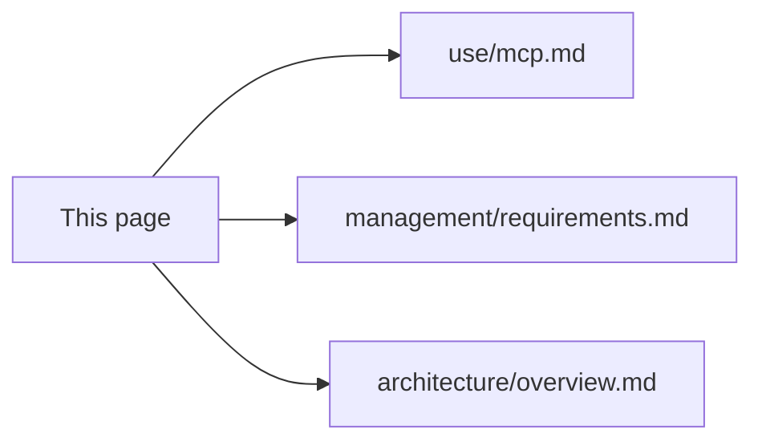

# MCP quick start

First-time setup to **verify** the MCP server and **use** it from an MCP host (e.g. Cursor). Full reference: [use/mcp.md](../use/mcp.md).

## Point MCP at your PDF folder (corpus)

The usual workflow: you keep PDFs in a **single directory** (e.g. `examples/`, `docs/papers/`, or any path on disk). MCP **`ingest`** indexes that folder; **`query`** answers questions using the built index under `PDF_TO_RAG_CWD`.

1. **Choose** the absolute path to your PDF directory (call it your **corpus**).
2. **Set** `PDF_TO_RAG_CWD` to the project (or workspace) where the index should live—default index is `<cwd>/.pdf-to-rag/`.
3. **Allowlist** paths the server may read:
   - If the corpus is **inside** `PDF_TO_RAG_CWD` (e.g. `…/my-repo/examples`), you often only need `PDF_TO_RAG_CWD`—relative `ingest` paths like `"examples"` work.
   - If the corpus is **outside** cwd, set **`PDF_TO_RAG_ALLOWED_DIRS`** (comma-separated absolutes) and/or **`PDF_TO_RAG_SOURCE_DIR`** (see [use/mcp.md § Environment](../use/mcp.md#install-and-run)).
4. **Optional:** Set **`PDF_TO_RAG_SOURCE_DIR`** to your corpus absolute path so **`ingest`** can be called **without** a `path` argument (defaults to that directory) and that path is always allowlisted.

Example for this repo with PDFs under `examples/`:

```json
{
  "mcpServers": {
    "pdf-to-rag": {
      "command": "node",
      "args": ["/absolute/path/to/pdfToRag/dist/mcp/server.js"],
      "env": {
        "PDF_TO_RAG_CWD": "/absolute/path/to/pdfToRag",
        "PDF_TO_RAG_SOURCE_DIR": "/absolute/path/to/pdfToRag/examples",
        "PDF_TO_RAG_ALLOWED_DIRS": "/absolute/path/to/pdfToRag/examples"
      }
    }
  }
}
```

You can omit `PDF_TO_RAG_ALLOWED_DIRS` when the corpus lies under `PDF_TO_RAG_CWD` and you pass `path: "examples"` to **`ingest`**. Keep **`PDF_TO_RAG_SOURCE_DIR`** when you want the model to call **`ingest`** with no `path`.

See [use/mcp.md § Security](../use/mcp.md#security) before exposing this server broadly.

## Prerequisites

- **Node.js 18+** ([requirements § Runtime](../management/requirements.md#runtime-and-environment))
- **Clone** this repo and run **`npm install`** in the project root (or install the package from npm when published)
- **Disk / network:** First embedding use may download the default Transformers model (tens of MB), unless you use **Ollama** (`PDF_TO_RAG_EMBED_BACKEND=ollama` + `OLLAMA_EMBED_MODEL`). See [requirements § Dependencies](../management/requirements.md#dependencies) and set `TRANSFORMERS_CACHE` if you want a fixed cache directory for Transformers
- **Large folders:** Add the same Ollama-related env vars to your MCP `mcp.json` as in [use/mcp.md § Environment](../use/mcp.md#install-and-run) so ingest stays fast (~minutes vs ~tens of minutes for big multi-PDF trees on the default path)

## Verify the build

From the repo root:

```bash
npm run build
npm run mcp:smoke
```

Expected: a line like `mcp:smoke ok: ingest, inspect, query, search + ingest default path`. If it fails, ensure `dist/mcp/server.js` exists after `build` and Node is 18+.

## HTTP/SSE transport (alternate)

For MCP hosts that cannot use stdio (e.g. remote deployments, web clients), use the HTTP server instead:

```bash
npm run mcp:http        # demo UI http://127.0.0.1:3000/  ·  MCP http://127.0.0.1:3000/mcp
# or
PDF_TO_RAG_HTTP_PORT=4000 node dist/mcp/server-http.js
```

All the same tools and env vars apply. **`GET /`** serves a **vanilla HTML** demo that calls **`/mcp`** (see [use/mcp.md § Web demo UI](../use/mcp.md#web-demo-ui-f19)). The stdio server (`dist/mcp/server.js`) remains the recommended transport for local single-user setups. See [use/mcp.md § HTTP/SSE transport](../use/mcp.md#httpsse-transport-phase-5) for full options.

## Configure Cursor (MCP)

1. Build the project (`npm run build`).
2. Open **Cursor → Settings → MCP** (or your `mcp.json` config).
3. Add a server entry. Replace **all** paths with absolute paths on your machine. Use the **Point MCP at your PDF folder** section above for corpus-focused env vars.

Minimal pattern (corpus under project root, explicit relative path on ingest):

```json
{
  "mcpServers": {
    "pdf-to-rag": {
      "command": "node",
      "args": ["/absolute/path/to/pdfToRag/dist/mcp/server.js"],
      "env": {
        "PDF_TO_RAG_CWD": "/absolute/path/to/pdfToRag",
        "PDF_TO_RAG_ALLOWED_DIRS": "/absolute/path/to/pdfToRag/examples"
      }
    }
  }
}
```

## First-use tool sequence

Use these from the MCP client after the server connects:

1. **`inspect`** — Confirms the index path and chunk count (often `0` before first ingest).
2. **`ingest`** — Index your corpus: pass `path` (e.g. `"examples"` or an absolute dir), or omit `path` if **`PDF_TO_RAG_SOURCE_DIR`** is set. Unchanged PDFs are skipped on later runs (**F13**). First run can be slow (model load + embeddings), especially for huge PDF sets on the **default Transformers** path; **Ollama + GPU/Metal** is recommended for that case.
3. **`query`** — Pass a `question`; optional `minScore`, `mmr`, `mmrLambda`, `topK`. Results include `text`, `fileName`, and `page` citations. For short or abstract questions, optionally pass `hypotheticalAnswer` (a caller-generated answer) to use **HyDE** — the server embeds it as a passage instead of the raw question, closing the query-to-passage gap (**F15**).
4. **`search`** (optional) — Same as **`query`**, but if the index is empty it **auto-ingests** from `sourceDir` or **`PDF_TO_RAG_SOURCE_DIR`** first — convenient for single-step Q&A.

The **first** `ingest`, **`query`**, or **`search`** in a process loads the embedding model; expect delay and CPU use until the model is cached.

## Where to go next



- [use/mcp.md](../use/mcp.md) — tool arguments, structured `ok` / `error` payloads, troubleshooting, resource expectations
- [management/requirements.md](../management/requirements.md) — dependencies and expectations
- [architecture/overview.md](../architecture/overview.md) — how MCP calls `application/`
