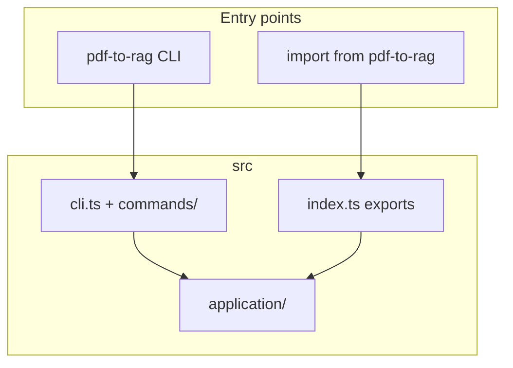
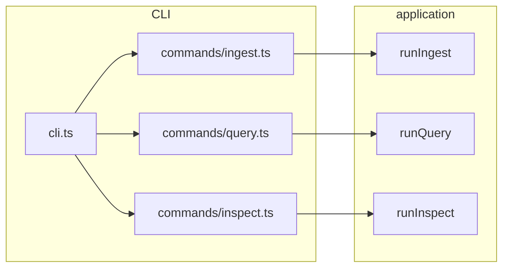

# CLI and library

The **CLI** and **programmatic API** share the same behavior as the MCP tools. Authoritative command-line options and a full library example live in the root [README.md](../../README.md); this page maps usage to **source files** and shows how surfaces converge.

## Three surfaces, one application layer

| What you run | Source | Calls |
|--------------|--------|--------|
| `pdf-to-rag ingest …` | `commands/ingest.ts` | `runIngest` |
| `pdf-to-rag query …` | `commands/query.ts` | `runQuery` |
| `pdf-to-rag inspect …` | `commands/inspect.ts` | `runInspect` |
| `import { runIngest, … }` | `application/index.ts` (via `index.ts`) | Same `run*` functions |

## Command → module map

## Index and config

- Default store directory, chunk sizes, embedding model, and index file name come from **`src/config/defaults.ts`** (`defaultConfig`, etc.). Defaults include **`contextPrefix`** and **`mmr`** (see **`PdfToRagConfig`**); the CLI only exposes a subset via flags (`--no-strip-margins`, etc.); MCP **`query`** / **`search`** accept per-call **`mmr`** / **`minScore`**.
- **Embedding backend** is selected in **`createAppDeps`** (`src/application/factory.ts`) from **`PDF_TO_RAG_EMBED_BACKEND`** (default Transformers; **`ollama`** + **`OLLAMA_EMBED_MODEL`** for the fast path). Optional asymmetric prefixes: **`PDF_TO_RAG_QUERY_PREFIX`** / **`PDF_TO_RAG_PASSAGE_PREFIX`** (**F11**). See [requirements § F7](../management/requirements.md#functional-traceability) and root [README.md](../../README.md).
- **Ingest** uses mtime+size fingerprints to skip unchanged PDFs (**F13**); switching embedding model or backend still requires a full re-ingest (**F7**).
- On disk: `<store-dir>/index.json` (v3 metadata, no embedding arrays) + `index.bin` (raw `Float32Array` vectors) + `index.hnsw` (HNSW index, built automatically when chunk count exceeds `PDF_TO_RAG_HNSW_THRESHOLD`, default 2000). Re-ingest after switching backend or model; index schema upgrades transparently on load.
- **Cross-encoder reranking:** Set `PDF_TO_RAG_RERANK_MODEL` to a Hugging Face cross-encoder id (e.g. `cross-encoder/ms-marco-MiniLM-L-6-v2`). The top `rerankTopN` (default 50) cosine candidates are re-scored and the final `topK` are returned in cross-encoder order. Reranking supersedes MMR when both are configured.

## Validate queries and quotations

After **`ingest`**, check the index and run **`query`** from the **same working directory**, **`--store-dir`**, and embedding env (**`PDF_TO_RAG_EMBED_BACKEND`**, **`OLLAMA_*`**) you used for ingest ([requirements § F8](../management/requirements.md#functional-traceability)).

1. **`pdf-to-rag inspect`** — chunk count and source files (does not load the embedding model).
2. **`pdf-to-rag query “your question” --top-k 5`** — prints a **match count** line (how many passages returned, and **`topK`**), then ranked hits. Natural-language questions are supported (e.g. long-form “what are the chemicals…” style queries). Each hit’s body is **verbatim text** from an indexed chunk; use **`fileName`** and **`page`** (and **`score`**) as citations when quoting. This package does **not** merge hits into one paraphrased “answer”; hosts or LLMs compose answers **from** these excerpts. See [requirements § F9](../management/requirements.md#functional-traceability). For the library API, `runQuery` accepts an optional `hypotheticalAnswer` string — when provided it is embedded with the passage role in place of the question (HyDE, **F15**), improving retrieval for short or abstract queries.

**Automated check:** `npm run examples:smoke` ingests the smallest PDF under `examples/`, runs a **natural-language** query, and asserts the CLI summary line (`Returned … passage(s)`, `topK=`) plus citation-style output (`page`, `score=`). For **JSON-defined NL questions and expected verbatim substrings** against `examples/`, see [`examples/README.md`](../../examples/README.md) (`examples/query-fixtures.json`, `npm run examples:fixtures`, optional `--verbose`). See [roadmap § Query validation](../management/roadmap.md#query-validation-quotation-ready-retrieval-and-testing).

## MCP

For AI clients and stdio MCP hosts, see [mcp.md](./mcp.md) and [onboarding/mcp.md](../onboarding/mcp.md). The HTTP entrypoint (`pdf-to-rag-mcp-http`, `npm run mcp:http`) also serves static pages under `public/` and provides **`/demo.html`** as a browser MCP client—see [mcp.md § Web demo UI](./mcp.md#web-demo-ui-f19).

## Deeper structure

Pipeline stages, storage, and embedder placement: [architecture/overview.md](../architecture/overview.md).
