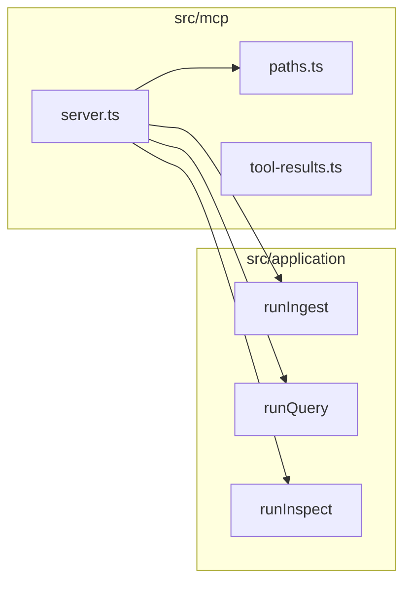

# Model Context Protocol (MCP) server

The **`pdf-to-rag-mcp`** command exposes the same ingest, query, and inspect flows as the CLI through MCP **tools** over **stdio**, plus a **`search`** tool that can **auto-ingest** when the index is empty. The server is a thin layer: it validates paths, builds `AppDeps` via `createAppDeps`, and calls `runIngest`, `runQuery`, or `runInspect` from the library (`src/mcp/server.ts` → `src/application/`).

**Quick start:** First-time setup, build verification, Cursor config, and suggested tool order — [onboarding/mcp.md](../onboarding/mcp.md).

## Corpus directory (your PDF folder)

MCP is meant to index a **directory of PDFs** you choose—the **corpus**—then answer questions with citations.

| Concept | Role |
|---------|------|
| **Corpus** | Folder containing `.pdf` files (e.g. `examples/`, or any absolute path). |
| **`ingest` `path`** | That folder, as absolute path or relative to **`PDF_TO_RAG_CWD`**. |
| **Index** | Written under **`PDF_TO_RAG_CWD`** in `storeDir` (default `.pdf-to-rag`). |
| **`PDF_TO_RAG_SOURCE_DIR`** | Optional. Absolute path to your default corpus: added to **allowed roots**, and used when **`ingest`** is called **without** `path`. |

If the corpus lies **under** `PDF_TO_RAG_CWD`, relative paths like `"examples"` work and you may not need `PDF_TO_RAG_ALLOWED_DIRS`. If it lies **outside** cwd, set **`PDF_TO_RAG_ALLOWED_DIRS`** and/or **`PDF_TO_RAG_SOURCE_DIR`** so the resolved ingest path passes the allowlist.

See [onboarding/mcp.md](../onboarding/mcp.md) for a Cursor `mcp.json` example using `examples/`.

## Install and run

From a built clone:

```bash
npm install
npm run build
```

Run the server (stdio; intended for MCP hosts, not interactive use):

```bash
npx pdf-to-rag-mcp
# or
node dist/mcp/server.js
```

Environment:

| Variable | Purpose |
|----------|---------|
| `PDF_TO_RAG_CWD` | Working directory for resolving relative paths and default store (default: `process.cwd()`). |
| `PDF_TO_RAG_ALLOWED_DIRS` | Comma-separated absolute directories. Ingest `path` (and the index `storeDir`) must lie inside an allowed root. If unset, only `PDF_TO_RAG_CWD` (or cwd) is allowed. |
| `PDF_TO_RAG_ROOT` | Single absolute directory treated as an extra allowed root (optional; combined with allowed dirs logic). |
| `PDF_TO_RAG_SOURCE_DIR` | Optional absolute path to your **default PDF corpus**. That directory is added to allowed roots. If set, **`ingest`** may omit `path` and will use this directory. |
| `TRANSFORMERS_CACHE` | Transformers.js model cache (see root README). |
| `PDF_TO_RAG_EMBED_BACKEND` | `transformers` (default) or **`ollama`** for local Ollama embeddings. |
| `OLLAMA_EMBED_MODEL` | Required when backend is `ollama` (e.g. `nomic-embed-text`). |
| `OLLAMA_HOST` | Ollama base URL (default `http://127.0.0.1:11434`). |
| `OLLAMA_EMBED_BATCH_SIZE` | Max strings per `/api/embed` request (default `128`). |
| `OLLAMA_EMBED_CONCURRENCY` | Parallel `/api/embeddings` calls when batch API is unavailable (default `8`). |
| `PDF_TO_RAG_QUERY_PREFIX` / `PDF_TO_RAG_PASSAGE_PREFIX` | Optional prefixes for asymmetric embedding (**F11**); e.g. E5-style `"query: "` / `"passage: "`. Empty by default (no-op for mpnet). |
| `PDF_TO_RAG_RERANK_MODEL` | Optional Hugging Face cross-encoder model id (e.g. `cross-encoder/ms-marco-MiniLM-L-6-v2`). When set, the top `rerankTopN` (default 50) cosine candidates are re-scored by the cross-encoder and the final `topK` are returned in cross-encoder order. Re-ranking supersedes MMR. Downloads the model on first use via `@xenova/transformers`. |
| `PDF_TO_RAG_HNSW_THRESHOLD` | Integer chunk count above which HNSW approximate nearest-neighbor search is used instead of linear cosine search (default `2000`). Requires `hnswlib-node`. Set to a very high number to disable HNSW. |
| `PDF_TO_RAG_HTTP_PORT` | Port for the HTTP/SSE server (`pdf-to-rag-mcp-http`). Default `3000`. |
| `PDF_TO_RAG_HTTP_HOST` | Host for the HTTP/SSE server. Default `127.0.0.1`. |
| `PDF_TO_RAG_HTTP_STATEFUL` | Set to `1` to enable session tracking in the HTTP server (stateful mode). Default: stateless. |

For **large corpora**, prefer **`PDF_TO_RAG_EMBED_BACKEND=ollama`** with a pulled embed model and Ollama using **GPU or Metal**; keep the same env for both **`ingest`** and **`query`**. Changing **backend or model** changes the vector space — **re-ingest** the corpus (incremental **file** skips from **F13** do not apply across model/backend changes; see **F7**).

## Tools

### `ingest`

Scan a directory for PDFs, chunk, embed, and **merge** into the index under `storeDir`. **Unchanged** files (same mtime+size as recorded in the index) are **skipped** — same pipeline as `pdf-to-rag ingest` (**F13**).

**Input (JSON arguments):**

| Field | Type | Required | Description |
|-------|------|----------|-------------|
| `path` | string | no | Directory to scan for `.pdf` files. If omitted, **`PDF_TO_RAG_SOURCE_DIR`** must be set (see Environment). |
| `storeDir` | string | no | Index directory relative to cwd (default `.pdf-to-rag`). |
| `chunkSize` | number | no | Max chunk length in characters. |
| `overlap` | number | no | Chunk overlap in characters. |
| `recursive` | boolean | no | Scan subdirectories (default `true`). |
| `stripMargins` | boolean | no | Strip page headers/footers before chunking (default `true`; set `false` to keep margin text). |

**Success payload:** `ok: true`, `data` with `filesProcessed`, `filesSkipped` (optional), `pagesProcessed`, `chunksIndexed`, `storePath`.

### `query`

Semantic search over the index (embedding similarity over chunks). Accepts full **natural-language questions** (e.g. long questions about chemicals, the brain, policies—not keywords only).

**Input:**

| Field | Type | Required | Description |
|-------|------|----------|-------------|
| `question` | string | yes | Natural language question or phrase. |
| `topK` | number | no | Maximum number of hits to return (default from config). |
| `minScore` | number | no | Minimum cosine similarity (0–1); chunks below are dropped. |
| `mmr` | boolean | no | Apply Maximal Marginal Relevance for diversity (default `false`; **F14**). |
| `mmrLambda` | number | no | MMR trade-off: 1 = relevance, 0 = diversity (default `0.5`). |
| `hypotheticalAnswer` | string | no | **HyDE (F15):** A hypothetical answer to the question generated by the calling LLM. When provided, it is embedded as a passage in place of the question, narrowing the query-to-passage gap for short or abstract queries. The calling model generates this text; pdf-to-rag does not generate prose. |
| `storeDir` | string | no | Index directory (default `.pdf-to-rag`). |

**HyDE two-call pattern:** The calling model first generates a hypothetical answer for the question, then passes it as `hypotheticalAnswer` in a second `query` call. This is opt-in and adds one LLM round-trip. Document this in your MCP host prompt: *"When the question is short or abstract, first generate a 2–3 sentence hypothetical answer, then pass it as `hypotheticalAnswer` to the `query` tool."*

**Success payload:** `ok: true`, `data.hits[]` with `text`, `fileName`, `page`, `score`, `chunkId`. Optional `data.warning` when the index is empty. The **number of matches** is **`data.hits.length`** (≤ `topK`). Each `text` is a **verbatim** excerpt suitable for **quotation** with `fileName` / `page`; there is no single synthesized “answer” field—clients compose answers from these hits if needed ([requirements § F9](../management/requirements.md#functional-traceability)).

### `search`

Same retrieval as **`query`**, but if the index has **no chunks**, the server **runs ingest** first using `sourceDir` or **`PDF_TO_RAG_SOURCE_DIR`**, then queries. Use for one-shot “ask the corpus” flows without a separate ingest step.

**Input:** Same optional fields as **`query`**, plus:

| Field | Type | Required | Description |
|-------|------|----------|-------------|
| `sourceDir` | string | no | PDF directory to ingest when the index is empty (absolute or relative to **`PDF_TO_RAG_CWD`**). Defaults to **`PDF_TO_RAG_SOURCE_DIR`** when omitted. |

**Success payload:** `ok: true`, `data.hits[]` as in **`query`**. When auto-ingest ran, `data.autoIngested: true` and `data.ingest` mirror the **`ingest`** success shape.

### `inspect`

Index statistics without loading the embedding model.

**Input:**

| Field | Type | Required |
|-------|------|----------|
| `storeDir` | string | no |

**Success payload:** `ok: true`, `data` with `storePath`, `chunkCount`, `files[]`.

### Error shape

On validation or runtime errors, tools return structured content with `ok: false`:

```json
{
  "ok": false,
  "version": "0.1.0",
  "error": {
    "code": "PATH_NOT_ALLOWED",
    "message": "human-readable message"
  }
}
```

| Code | When |
|------|------|
| `PATH_NOT_ALLOWED` | Resolved ingest or store path is outside configured allowed roots. Often fix by adding your corpus to **`PDF_TO_RAG_ALLOWED_DIRS`** or setting **`PDF_TO_RAG_SOURCE_DIR`**, or use a path under **`PDF_TO_RAG_CWD`**. |
| `INVALID_INPUT` | Missing or invalid arguments (e.g. **`ingest`** with no `path` and no **`PDF_TO_RAG_SOURCE_DIR`**). |
| `INGEST_FAILED` | Ingest pipeline or embedding failed after path checks. |
| `QUERY_FAILED` | Query or embedding failed after path checks. |
| `SEARCH_FAILED` | **`search`** tool failed after path checks (query or auto-ingest). |
| `INSPECT_FAILED` | Could not read or parse the index. |
| `INTERNAL` | Unexpected error surfaced by the error mapper (rare in tools; prefer the specific codes above). |

Successful payloads always include `ok: true`, `version`, and `data` in `structuredContent` (and JSON text in `content`). The server does not register an MCP output schema validator (Zod 4 unions are not compatible with the current SDK normalizer); clients should parse `structuredContent` as JSON.

## Client configuration

### Cursor

Add an MCP server entry (Settings → MCP) pointing at your Node binary and the built server, for example:

```json
{
  "mcpServers": {
    "pdf-to-rag": {
      "command": "node",
      "args": ["/absolute/path/to/pdfToRag/dist/mcp/server.js"],
      "env": {
        "PDF_TO_RAG_CWD": "/absolute/path/to/your/project",
        "PDF_TO_RAG_SOURCE_DIR": "/absolute/path/to/your/project/examples",
        "PDF_TO_RAG_ALLOWED_DIRS": "/absolute/path/to/your/project/examples"
      }
    }
  }
}
```

Adjust paths for your machine. If the corpus folder is already under `PDF_TO_RAG_CWD`, you can omit `ALLOW_DIRS` / `SOURCE_DIR` when you always pass `path` on **`ingest`**. Using `npx` is possible if the package is published or linked globally.

## Security

- **Allowlist:** Always set `PDF_TO_RAG_ALLOWED_DIRS` and/or `PDF_TO_RAG_SOURCE_DIR` (or restrict `PDF_TO_RAG_CWD`) when the MCP server can be reached by tools you do not fully trust. Ingest refuses paths outside allowed roots.
- **Local process:** The server runs as your user; it can read PDFs and write the index under `storeDir`. Do not point allowed dirs at sensitive system paths unless intended.
- **Default path:** no paid embedding APIs; Transformers.js may download models from Hugging Face on first use.
- **Ollama path:** chunk text is sent to **`OLLAMA_HOST`** over HTTP (usually localhost). Use a **trusted** base URL; do not point at an untrusted remote server.

## Verification (developers)

From a clean build:

```bash
npm run build
npm run mcp:smoke
```

This spawns `dist/mcp/server.js` over stdio and checks that `ingest`, `inspect`, `query`, and `search` are registered, then calls `ingest` with default `PDF_TO_RAG_SOURCE_DIR`.

## Resource expectations

- **First ingest or query** in a process: **Transformers** loads the ONNX model (CPU-heavy). **Ollama** avoids that load but requires a running Ollama process and a pulled embed model.
- **Large PDF folders** can take many minutes on the default Transformers path; **Ollama + GPU/Metal** is recommended for large corpora. The MCP call blocks until completion.

## Troubleshooting

| Issue | Mitigation |
|-------|------------|
| First call is slow | Embedding model download; set `TRANSFORMERS_CACHE` to a persistent directory. |
| Smoke test fails to connect | Run `npm run build` so `dist/mcp/server.js` exists; ensure Node 18+. |
| PDF text empty / weird | Source PDF may be scanned images; this stack is text-extraction only. |
| Ingest path not allowed / `PATH_NOT_ALLOWED` | Include your corpus in **`PDF_TO_RAG_ALLOWED_DIRS`**, set **`PDF_TO_RAG_SOURCE_DIR`** to the corpus (also allowlists it), or use a directory under **`PDF_TO_RAG_CWD`**. |
| pdfjs worker errors | The library resolves `pdf.worker.mjs` from `pdfjs-dist`; use a supported Node (18+). |
| `Unable to load font data` / `FoxitSymbol.pfb` with spaces in repo path | Fixed in current `src/pdf/extract.ts` by passing filesystem paths for `standardFontDataUrl` / `cMapUrl` (not `file://` URLs). Rebuild (`npm run build`). |
| Query fails / dimension mismatch | **Re-ingest** with the same embedding backend and model as you use for **`query`** (`PDF_TO_RAG_EMBED_BACKEND`, `OLLAMA_EMBED_MODEL`). |
| `INGEST_FAILED` with Ollama | Ensure Ollama is running, **`OLLAMA_EMBED_MODEL`** is set, and the model is pulled (`ollama pull …`). |
| MCP client shows stderr noise | The server should not write to stdout when connected; diagnostics belong on stderr only. |

## HTTP/SSE transport (Phase 5)

For MCP hosts that cannot use stdio (e.g. remote deployments, web clients), use the **Streamable HTTP** transport:

```bash
# Start the HTTP server (requires npm run build first)
PDF_TO_RAG_CWD=/your/repo npx pdf-to-rag-mcp-http --port 3000
# or
npm run mcp:http
```

**Endpoints:** MCP Streamable HTTP traffic goes to **`POST` / `GET` `/mcp`**. The server is stateless by default (`PDF_TO_RAG_HTTP_STATEFUL=1` enables session tracking).

**Same path policy** as the stdio server: set `PDF_TO_RAG_CWD`, `PDF_TO_RAG_ALLOWED_DIRS`, `PDF_TO_RAG_SOURCE_DIR`, and embedding env vars as needed.

**Security note:** The HTTP server binds to `127.0.0.1` by default. Do not expose it on `0.0.0.0` without authentication and TLS. The stdio server is the recommended transport for single-user or local-only deployments.

### Web demo UI (F19)

After `npm run build`, **`GET`** serves HTML, CSS, and other static files from [public/](../../public/) (also included in the npm tarball under `public/`). Open **http://127.0.0.1:3000/** while **`pdf-to-rag-mcp-http`** is running.

| URL | Purpose |
|-----|---------|
| **`/`** or **`/index.html`** | Use-focused home (what it does, CTAs) |
| **`/setup.html`** | Install and run instructions; copyable commands and optional Cursor `mcp.json` |
| **`/about.html`** | Surfaces (CLI, library, MCP), local-first notes, links |
| **`/demo.html`** | Interactive demo: ingest, query, inspect via MCP in the browser |
| **`/styles.css`** | Shared stylesheet for the pages above |

Unknown paths under `public/` return **404**; traversal (e.g. `..`) is rejected.

- The **Try demo** page loads **`@modelcontextprotocol/sdk`** from **esm.sh** in the browser (network required on first load) and connects to **`/mcp`** on the same origin.
- Enter a **corpus directory** and **storeDir** that resolve under your allowlist, run **Ingest**, then **Query**. Results show **file, page, score**, and excerpt text.
- **Stateful mode:** If you set `PDF_TO_RAG_HTTP_STATEFUL=1`, use an MCP client that preserves **`Mcp-Session-Id`**; the vanilla demo targets the default **stateless** server.

One-command local try (from repo root, with PDFs under `examples/`):

```bash
npm run build
PDF_TO_RAG_CWD="$PWD" PDF_TO_RAG_ALLOWED_DIRS="$PWD/examples,$PWD" npm run mcp:http
# Browser: http://127.0.0.1:3000/demo.html  → corpus: examples  → Ingest → Query
```

## Version

The server reports the package `version` in MCP `serverInfo` and includes `version` in successful tool payloads where applicable.

## Code map



See also [architecture/overview.md](../architecture/overview.md).
